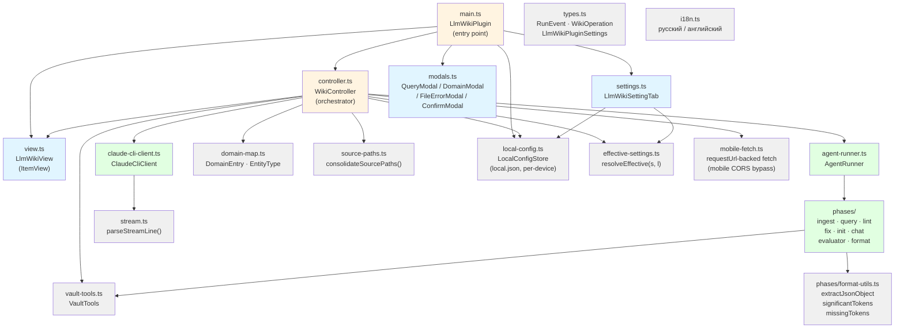

# Architecture Documentation — obsidian-llm-wiki

LLM Wiki — Obsidian-плагин для AI-powered компаундируемой базы знаний.  
Версия: **0.1.64** | Язык: TypeScript | Runtime: Electron (Obsidian Desktop) + WebView (Obsidian Mobile)

---

## Overview

Плагин предоставляет боковую панель в Obsidian, из которой пользователь запускает операции над доменной wiki:
- **ingest** — извлечение сущностей из активного файла в wiki
- **query / query-save** — запрос к базе знаний (с опциональным сохранением ответа)
- **lint / fix** — проверка качества wiki и автоматическое исправление
- **init** — начальная инициализация домена из source_paths
- **chat** — интерактивный диалог в контексте операции
- **format** — форматирование не-wiki markdown-страницы (preview → refine → apply)

Агент поддерживает два бэкенда: **Claude CLI** (iclaude.sh) и **нативный OpenAI-совместимый** (Ollama, OpenAI).

---

## Architecture Files

| Файл | Содержимое |
|------|-----------|
| [`overview.yaml`](overview.yaml) | Общий обзор: операции, паттерны, бэкенды, ограничения |
| [`diagrams/dependency-graph.md`](diagrams/dependency-graph.md) | Граф зависимостей между модулями |
| [`diagrams/data-flow.md`](diagrams/data-flow.md) | Потоки данных: выполнение операции, stream-parsing, выбор бэкенда |

---

## Component Map



---

## Key Architectural Decisions

### 1. Single-Flight Guard
Одновременно разрешена только одна операция (`WikiController.current`). Причина: `iclaude.sh` не реентерабелен, параллельный spawn испортит stdout-поток.

### 2. AsyncGenerator Event Stream
Операции возвращают `AsyncGenerator<RunEvent>`. Это позволяет передавать события в реальном времени в UI без колбэков и SharedState.

### 3. Backend Strategy Pattern
`LlmClient` — тонкий интерфейс (одно поле `chat.completions.create`). Две реализации:
- `ClaudeCliClient` — адаптирует spawn+stream-json к интерфейсу OpenAI SDK
- `new OpenAI(...)` — прямое подключение к OpenAI-совместимому API

### 4. Domain-Driven Config
Все wiki-домены хранятся в `settings.domains: DomainEntry[]`, персистируются через Obsidian (`saveData`/`loadData`). История операций — там же, лимит 20 записей.

### 5. Phases as Pure Generators
Каждая операция — отдельный файл в `src/phases/`, принимает `(args, vaultTools, llm, model, domains, vaultRoot, signal, opts)`, возвращает `AsyncGenerator<RunEvent>`. Нет глобального состояния.

### 6. Mobile Platform Branching (v0.1.59+)
Один bundle для desktop и mobile. Ветвление в рантайме через `Obsidian.Platform.isMobile`:
- `manifest.json`: `isDesktopOnly: false`.
- `main.ts`: команды `ingest/lint/init` регистрируются только на desktop. `loadSettings()` мигрирует `backend: claude-agent` → `native-agent` на mobile, принудительно выключает `nativeAgent.perOperation` и `devMode.enabled`. Также вызывает `migrateToLocalV1()` (one-shot перенос per-device полей в `local.json`).
- `controller.ts`: `dispatch()` и `dispatchChat()` отбрасывают не-query операции на mobile с Notice; `requireNativeAgent(eff)` принимает effective settings (overlay) и проверяет `baseUrl`/`apiKey`. Все `node:fs`/`node:path`/`./claude-cli-client` подгружаются через **`require()`** (esbuild оставляет CJS-вызов как есть для external'ов) — `await import("node:*")` бажит в Electron как ES dynamic import → `Failed to fetch dynamically imported module: node:fs`.
- `agent-runner.ts`: `writeDevLog`/`updateDevLogEval` пишут через `VaultTools.adapter` (не node:fs) — работают и на mobile.
- `phases/query.ts`: `node:path` удалён, путь к wiki vault-relative (`!Wiki/<subfolder>` через `domainWikiFolder()`); streaming-fallback на non-streaming при ошибке (mobileFetch не поддерживает stream).
- `settings.ts`: per-operation toggle, dev-mode block, claude-agent блок скрыты на mobile. Per-device поля (backend, agentLogEnabled, claudeAgent.{model,allowedTools}, nativeAgent.{baseUrl,apiKey,model,temperature,topP,numCtx}) пишутся в `local.json` через `localConfigStore.save()` (не в синхронизируемый `data.json`); UI читает effective view через `resolveEffective(s, l)`.
- Mobile fetch: `src/mobile-fetch.ts` (`requestUrl` Obsidian) подсовывается в OpenAI SDK как `fetch` опция — обходит CORS для cloud-LLM (Ollama Cloud, OpenRouter).
- Tests: `tests/no-fs-imports.test.ts` ловит top-level `node:*` импорты в hot path; `tests/mobile-fetch.test.ts` проверяет requestUrl-bridge.

Поддерживаемые на mobile операции: только `query` и `query-save`. Гайд по настройке провайдера: [`docs/mobile-cloud-ollama.md`](../mobile-cloud-ollama.md).

### 7. Format Operation (v0.1.62+)
Операция `format` — отдельная фаза `runFormat` (`src/phases/format.ts`), возвращает JSON `{report, formatted}` (схема `templates/_format-schema.md`, промт `prompts/format.md`).

- **Pre-flight guard:** `controller.format()` отклоняет файлы внутри wiki-домена (по `domainWikiFolder(d.wiki_folder)`) — открывается `ConfirmModal` с предложением запустить ingest из `wiki_sources` frontmatter.
- **Preview workflow:** результат пишется в `!Temp/<basename>.formatted.md`, событие `format_preview {tempPath, report, missingTokens}` рендерится в side-panel блоком с Apply/Cancel + чатом для refine. CSS отделяет блоки border-top'ами; чат-textarea на всю ширину панели, Send-кнопка в собственном ряду справа под textarea.
- **Validator (`format-utils.ts`, v0.1.64):** `significantTokens()` извлекает URL первыми, удаляет их из текста, затем парсит residual на числа, Latin-имена ≥3 букв, ALL-CAPS ≥2 букв, идентификаторы из inline/fenced code — числа внутри URL не дробятся в отдельные missing-токены. Кириллические capitalized слова не считаются значимыми. `missingTokens(orig, formatted)` сравнивает токены case-insensitive с word-boundary regex (через `[^A-Za-z0-9_]`) — `ClickHouse` находит `clickhouse`, `API` не матчит `rapid`, `2024` не матчит `20240`. Apply **больше не дисейблится** при непустом missing — показывается warning, но кнопка активна (предыдущая блокировка давала false-positive ≥80% случаев).
- **JSON-устойчивость (v0.1.63+):** запрос идёт с `response_format: { type: "json_object" }`. `extractJsonObject` снимает ```` ```json ```` обёртку, `repairJson` чинит trailing-commas + экранирует сырые control-chars (`\n`, `\r`, `\t`, и пр.) внутри строк. При первом провале — авто-retry с явной инструкцией «верни ТОЛЬКО валидный JSON, экранируй спецсимволы». Если `finish_reason === "length"` — retry пропускается, выдаётся ошибка «ответ обрезан, увеличьте maxTokens».
- **Refine loop:** `controller.formatRefine(msg)` добавляет user-message в `_pendingFormat.chat` и редиспатчит `format` — `runFormat` принимает `chatHistory` параметром, передаёт в LLM как продолжение диалога.
- **Lifecycle:** `formatApply` читает temp → перезаписывает оригинал через `vault.modify(TFile, content)` (буфер открытого редактора Obsidian обновляется; `adapter.write` обходил редактор и затирался при следующем save) → удаляет temp. `formatCancel` удаляет temp. Оба чистят `_pendingFormat` и эмитят `format_applied`/`format_cancelled` для UI cleanup.
- **Vision:** при `backend === claude-agent` `extractImagePaths()` собирает локальные image refs и передаёт их content-parts'ами в OpenAI message — для распознавания/описания.
- **Mobile:** разрешена в `dispatch()` mobile-guard'е (наряду с query/query-save) — поскольку использует тот же native-agent stream.

### 7a. ClaudeCliClient large-payload (v0.1.63+)
`ClaudeCliClient.chat.completions.create` собирает argv для `iclaude.sh`. Когда `userText > LARGE_THRESHOLD` (262 144 байт = 256 КБ; ARG_MAX на Linux ~2 МБ, 256 КБ inline безопасно), плагин:
1. Оборачивает контент: `<user_input>\n${userText}\n</user_input>`.
2. Пишет в `tmpDir/llm-wiki-usr-<id>.txt`, передаёт `--append-system-prompt-file <path>`.
3. `-p` несёт явную инструкцию «обработай содержимое из `<user_input>` согласно системному промпту».

Прежний workaround (`-p "."` + append) приводил к ответу haiku «Dot received. What's next?» — модель видела только точку и игнорировала контент в системном промпте. Симметричная ветка для systemContent работает аналогично через `--system-prompt-file`.

### 8. Per-Device Settings Overlay (v0.1.61+)
Settings разделены на два слоя:
- **`data.json`** (синхронизируется через Obsidian Sync) — domains, history, perOperation, operations[].*, timeouts, systemPrompt.
- **`local.json`** (per-device, не синхронизируется) — `backend`, `iclaudePath`, `agentLogEnabled`, `claudeAgent.{model,allowedTools}`, `nativeAgent.{baseUrl,apiKey,model,temperature,topP,numCtx}`, `migrated_v1`.

`resolveEffective(s, l)` (`src/effective-settings.ts`) сливает overlay поверх settings: при чтении в UI и в `controller.buildAgentRunner` всегда используется effective view. Запись per-device полей идёт через `patchLocal*` хелперы в `LlmWikiSettingTab`. `migrateToLocalV1()` при первом запуске копирует существующие значения из `data.json` в `local.json` и затирает `nativeAgent.apiKey` в синхронизируемом файле (security scrub). Цель — на каждом устройстве (desktop/mobile/laptop) свои model/baseUrl/apiKey без конфликтов синхронизации.

---

## Source Files Reference

| Файл | Роль |
|------|------|
| `src/main.ts` | Точка входа, регистрация команд/view/ribbon/settings |
| `src/controller.ts` | WikiController — single-flight, dispatch, domain/history management |
| `src/agent-runner.ts` | AgentRunner — маршрутизирует операцию в нужную phase, выбирает модель |
| `src/claude-cli-client.ts` | ClaudeCliClient — spawn iclaude.sh, readline, SIGTERM/SIGKILL |
| `src/stream.ts` | parseStreamLine() — парсинг одной stream-json строки → RunEvent |
| `src/view.ts` | LlmWikiView (ItemView) — живой рендер шагов, метрик, chat, history |
| `src/settings.ts` | LlmWikiSettingTab — настройки плагина |
| `src/modals.ts` | QueryModal, DomainModal, FileErrorModal, ConfirmModal |
| `src/types.ts` | Все TypeScript-типы: RunEvent, WikiOperation, LlmWikiPluginSettings |
| `src/domain-map.ts` | DomainEntry, EntityType, validateDomainId() |
| `src/vault-tools.ts` | VaultTools — read/write/list vault-файлов через VaultAdapter |
| `src/source-paths.ts` | consolidateSourcePaths() — дедупликация source_paths |
| `src/i18n.ts` | Локализация строк UI (ru/en) |
| `src/local-config.ts` | LocalConfigStore — `local.json` (per-device, не синхронизируется) |
| `src/effective-settings.ts` | `resolveEffective(s, l)` — overlay local поверх settings |
| `src/mobile-fetch.ts` | `mobileFetch` — `requestUrl`-backed fetch для OpenAI SDK на mobile (CORS) |
| `src/domain-store.ts` | DomainStore — JSON-хранилище доменов в vault (`!Wiki/_domain.json`) |
| `src/wiki-path.ts` | `domainWikiFolder()` — нормализация пути к wiki-папке |
| `src/phases/ingest.ts` | Фаза ingest |
| `src/phases/query.ts` | Фаза query / query-save |
| `src/phases/lint.ts` | Фаза lint |
| `src/phases/fix.ts` | Фаза fix |
| `src/phases/init.ts` | Фаза init |
| `src/phases/chat.ts` | Фаза chat (lint-chat) |
| `src/phases/evaluator.ts` | Dev-mode evaluator |
| `src/phases/format.ts` | Фаза format — JSON {report, formatted}, missing-tokens validator, !Temp/ preview |
| `src/phases/format-utils.ts` | extractJsonObject, significantTokens, missingTokens |
| `src/phases/llm-utils.ts` | Утилиты для LLM вызовов |
| `src/phases/template.ts` | Шаблоны промтов |
