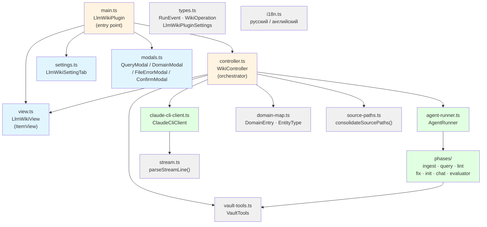

# Architecture Documentation — obsidian-llm-wiki

LLM Wiki — Obsidian-плагин для AI-powered компаундируемой базы знаний.  
Версия: **0.1.59** | Язык: TypeScript | Runtime: Electron (Obsidian Desktop) + WebView (Obsidian Mobile)

---

## Overview

Плагин предоставляет боковую панель в Obsidian, из которой пользователь запускает операции над доменной wiki:
- **ingest** — извлечение сущностей из активного файла в wiki
- **query / query-save** — запрос к базе знаний (с опциональным сохранением ответа)
- **lint / fix** — проверка качества wiki и автоматическое исправление
- **init** — начальная инициализация домена из source_paths
- **chat** — интерактивный диалог в контексте операции

Агент поддерживает два бэкенда: **Claude CLI** (iclaude.sh) и **нативный OpenAI-совместимый** (Ollama, OpenAI).

---

## Architecture Files

| Файл | Содержимое |
|------|-----------|
| [`overview.yaml`](overview.yaml) | Общий обзор: операции, паттерны, бэкенды, ограничения |
| [`diagrams/dependency-graph.md`](diagrams/dependency-graph.md) | Граф зависимостей между модулями |
| [`diagrams/data-flow.md`](diagrams/data-flow.md) | Потоки данных: выполнение операции, stream-parsing, выбор бэкенда |

---

## Component Map

---

## Key Architectural Decisions

### 1. Single-Flight Guard
Одновременно разрешена только одна операция (`WikiController.current`). Причина: `iclaude.sh` не реентерабелен, параллельный spawn испортит stdout-поток.

### 2. AsyncGenerator Event Stream
Операции возвращают `AsyncGenerator<RunEvent>`. Это позволяет передавать события в реальном времени в UI без колбэков и SharedState.

### 3. Backend Strategy Pattern
`LlmClient` — тонкий интерфейс (одно поле `chat.completions.create`). Две реализации:
- `ClaudeCliClient` — адаптирует spawn+stream-json к интерфейсу OpenAI SDK
- `new OpenAI(...)` — прямое подключение к OpenAI-совместимому API

### 4. Domain-Driven Config
Все wiki-домены хранятся в `settings.domains: DomainEntry[]`, персистируются через Obsidian (`saveData`/`loadData`). История операций — там же, лимит 20 записей.

### 5. Phases as Pure Generators
Каждая операция — отдельный файл в `src/phases/`, принимает `(args, vaultTools, llm, model, domains, vaultRoot, signal, opts)`, возвращает `AsyncGenerator<RunEvent>`. Нет глобального состояния.

### 6. Mobile Platform Branching (v0.1.59+)
Один bundle для desktop и mobile. Ветвление в рантайме через `Obsidian.Platform.isMobile`:
- `manifest.json`: `isDesktopOnly: false`.
- `main.ts`: команды `ingest/lint/init` регистрируются только на desktop. `loadSettings()` мигрирует `backend: claude-agent` → `native-agent` на mobile.
- `controller.ts`: `dispatch()` и `dispatchChat()` отбрасывают не-query операции на mobile с Notice. `requireNativeAgent()` проверяет `baseUrl` + `apiKey` непустыми. Все `node:fs`/`node:path`/`./claude-cli-client` импорты — динамические, внутри ветки `backend === "claude-agent"` или за `Platform.isMobile` guard.
- `agent-runner.ts`: `writeDevLog`/`updateDevLogEval` async, ранний выход на mobile.
- `phases/query.ts`: `node:path` удалён, путь к wiki вычисляется как vault-relative (`!Wiki/<subfolder>` через `domainWikiFolder()`), защита от `..`-сегментов.
- `settings.ts`: backend dropdown и agentLog toggle скрыты на mobile.
- Tests: `tests/no-fs-imports.test.ts` ловит регрессии — top-level `node:*` import в hot path.

Поддерживаемые на mobile операции: только `query` и `query-save`. Гайд по настройке провайдера: [`docs/mobile-cloud-ollama.md`](../mobile-cloud-ollama.md).

---

## Source Files Reference

| Файл | Роль |
|------|------|
| `src/main.ts` | Точка входа, регистрация команд/view/ribbon/settings |
| `src/controller.ts` | WikiController — single-flight, dispatch, domain/history management |
| `src/agent-runner.ts` | AgentRunner — маршрутизирует операцию в нужную phase, выбирает модель |
| `src/claude-cli-client.ts` | ClaudeCliClient — spawn iclaude.sh, readline, SIGTERM/SIGKILL |
| `src/stream.ts` | parseStreamLine() — парсинг одной stream-json строки → RunEvent |
| `src/view.ts` | LlmWikiView (ItemView) — живой рендер шагов, метрик, chat, history |
| `src/settings.ts` | LlmWikiSettingTab — настройки плагина |
| `src/modals.ts` | QueryModal, DomainModal, FileErrorModal, ConfirmModal |
| `src/types.ts` | Все TypeScript-типы: RunEvent, WikiOperation, LlmWikiPluginSettings |
| `src/domain-map.ts` | DomainEntry, EntityType, validateDomainId() |
| `src/vault-tools.ts` | VaultTools — read/write/list vault-файлов через VaultAdapter |
| `src/source-paths.ts` | consolidateSourcePaths() — дедупликация source_paths |
| `src/i18n.ts` | Локализация строк UI (ru/en) |
| `src/phases/ingest.ts` | Фаза ingest |
| `src/phases/query.ts` | Фаза query / query-save |
| `src/phases/lint.ts` | Фаза lint |
| `src/phases/fix.ts` | Фаза fix |
| `src/phases/init.ts` | Фаза init |
| `src/phases/chat.ts` | Фаза chat (lint-chat) |
| `src/phases/evaluator.ts` | Dev-mode evaluator |
| `src/phases/llm-utils.ts` | Утилиты для LLM вызовов |
| `src/phases/template.ts` | Шаблоны промтов |
