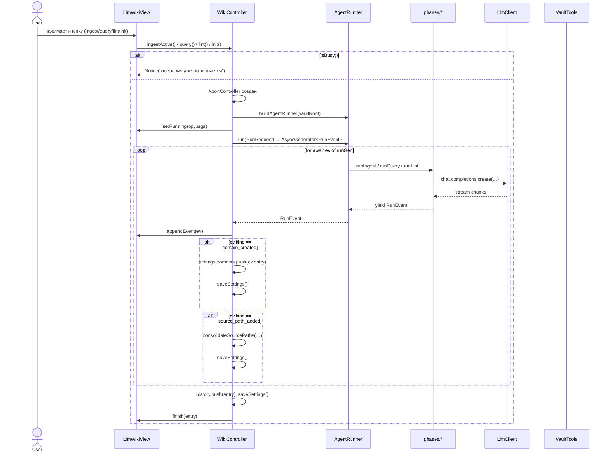
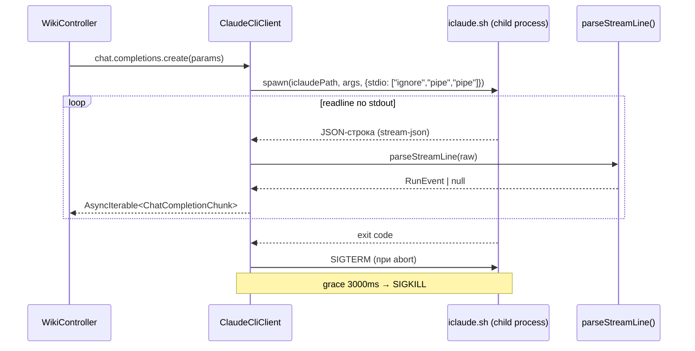
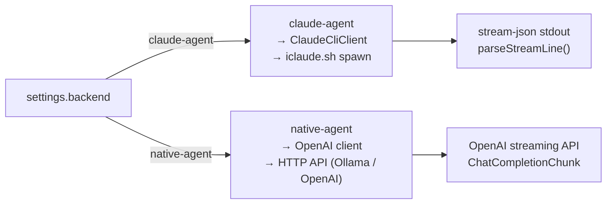

# Data Flow — obsidian-llm-wiki

## Operation Execution Flow



## Claude CLI Backend: Stream Parsing



## Format Operation: Preview → Refine → Apply (v0.1.62+)

```mermaid
sequenceDiagram
    actor User
    participant View as LlmWikiView
    participant Ctrl as WikiController
    participant Runner as AgentRunner
    participant Phase as runFormat
    participant Utils as format-utils
    participant LLM as LlmClient
    participant Vault as VaultTools

    User->>View: нажимает Format на не-wiki .md
    View->>Ctrl: format()

    alt файл внутри wiki-домена
        Ctrl->>View: ConfirmModal "re-ingest from wiki_sources?"
        View-->>User: предложение запустить ingest
    else файл вне wiki
        Ctrl->>Ctrl: _pendingFormat = {originalPath, tempPath:"", chat:[]}
        Ctrl->>Runner: dispatch("format", [path], chatMessages=[])
        Runner->>Phase: runFormat(args, vaultTools, llm, hasVision, chatHistory, signal)
        Phase->>Vault: read(originalPath)
        Phase->>LLM: chat.completions.create(messages, stream=true)
        LLM-->>Phase: stream chunks → yield assistant_text
        Phase->>Utils: extractJsonObject(fullText) → {report, formatted}
        Phase->>Utils: missingTokens(original, formatted)
        Phase->>Vault: mkdir(!Temp), write(!Temp/<basename>.formatted.md)
        Phase-->>Ctrl: yield format_preview {tempPath, report, missingTokens}
        Ctrl->>Ctrl: _pendingFormat.tempPath = tempPath; chat.push({role:"assistant", content:report})
        Ctrl->>View: appendEvent(format_preview) → renderFormatPreview()
        View-->>User: preview-блок с Apply/Cancel/Refine chat
    end

    alt Refine (User вводит уточнение)
        User->>View: текст в format-chat
        View->>Ctrl: formatRefine(message)
        Ctrl->>Ctrl: _pendingFormat.chat.push({role:"user", content:message})
        Ctrl->>Runner: dispatch("format", [originalPath], chatMessages=_pendingFormat.chat)
        Note over Phase: повторный цикл LLM → новый format_preview
    else Apply
        User->>View: click Apply
        View->>Ctrl: formatApply()
        Ctrl->>Vault: read(tempPath) → write(originalPath) → remove(tempPath)
        Ctrl->>View: emit format_applied → renderFormatPreview cleanup
    else Cancel
        User->>View: click Cancel
        View->>Ctrl: formatCancel()
        Ctrl->>Vault: remove(tempPath)
        Ctrl->>View: emit format_cancelled → renderFormatPreview cleanup
    end
```

Note: `Apply` дисейблится в UI при `missingTokens.length > 0` — защита от потери значимой информации (числа, URL, имена, code identifiers).

## Backend Strategy


