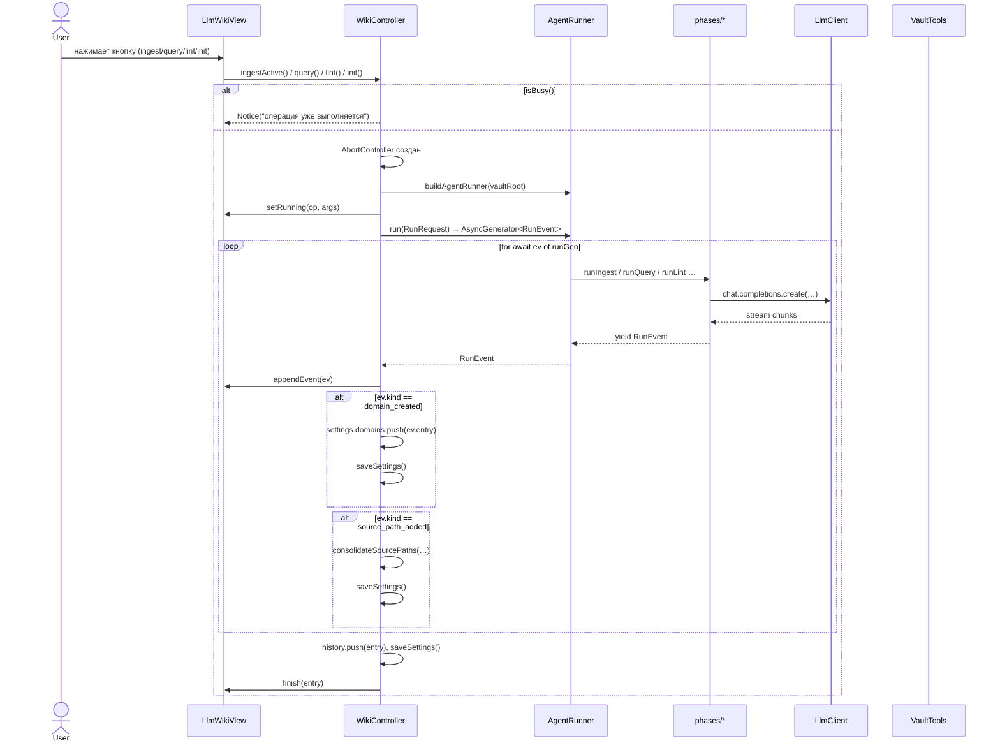
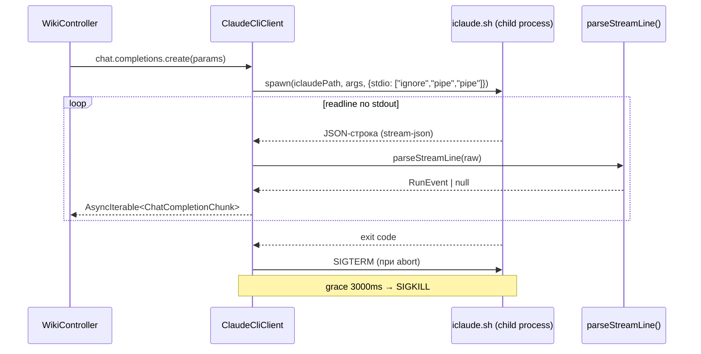
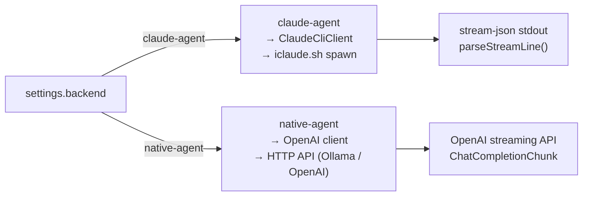

# Data Flow — obsidian-llm-wiki

## Operation Execution Flow

```mermaid
sequenceDiagram
    actor User
    participant View as LlmWikiView
    participant Ctrl as WikiController
    participant Runner as AgentRunner
    participant Phases as phases/*
    participant LLM as LlmClient
    participant Vault as VaultTools

    User->>View: нажимает кнопку (ingest/query/lint/init)
    View->>Ctrl: ingestActive() / query() / lint() / init()

    alt isBusy()
        Ctrl-->>View: Notice("операция уже выполняется")
    else
        Ctrl->>Ctrl: AbortController создан
        Ctrl->>Runner: buildAgentRunner(vaultRoot)
        Ctrl->>View: setRunning(op, args)

        Ctrl->>Runner: run(RunRequest) → AsyncGenerator<RunEvent>

        loop for await ev of runGen
            Runner->>Phases: runIngest / runQuery / runLint …
            Phases->>LLM: chat.completions.create(…)
            LLM-->>Phases: stream chunks
            Phases-->>Runner: yield RunEvent
            Runner-->>Ctrl: RunEvent
            Ctrl->>View: appendEvent(ev)

            alt ev.kind == domain_created
                Ctrl->>Ctrl: settings.domains.push(ev.entry)
                Ctrl->>Ctrl: saveSettings()
            end
            alt ev.kind == source_path_added
                Ctrl->>Ctrl: consolidateSourcePaths(…)
                Ctrl->>Ctrl: saveSettings()
            end
        end

        Ctrl->>Ctrl: history.push(entry), saveSettings()
        Ctrl->>View: finish(entry)
    end
```

## Claude CLI Backend: Stream Parsing

```mermaid
sequenceDiagram
    participant Ctrl as WikiController
    participant CLI as ClaudeCliClient
    participant Proc as iclaude.sh (child process)
    participant Parser as parseStreamLine()

    Ctrl->>CLI: chat.completions.create(params)
    CLI->>Proc: spawn(iclaudePath, args, {stdio: ["ignore","pipe","pipe"]})

    loop readline по stdout
        Proc-->>CLI: JSON-строка (stream-json)
        CLI->>Parser: parseStreamLine(raw)
        Parser-->>CLI: RunEvent | null
        CLI-->>Ctrl: AsyncIterable<ChatCompletionChunk>
    end

    Proc-->>CLI: exit code
    CLI->>Proc: SIGTERM (при abort)
    Note over CLI,Proc: grace 3000ms → SIGKILL
```

## Backend Strategy

```mermaid
graph LR
    settings["settings.backend"]
    claude["claude-agent\n→ ClaudeCliClient\n→ iclaude.sh spawn"]
    native["native-agent\n→ OpenAI client\n→ HTTP API (Ollama / OpenAI)"]

    settings -- "claude-agent" --> claude
    settings -- "native-agent" --> native

    claude --> stream_json["stream-json stdout\nparseStreamLine()"]
    native --> openai_stream["OpenAI streaming API\nChatCompletionChunk"]
```
