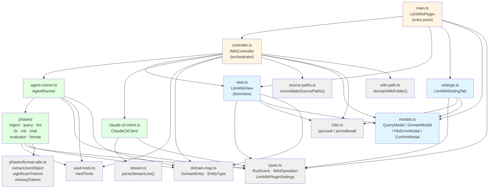
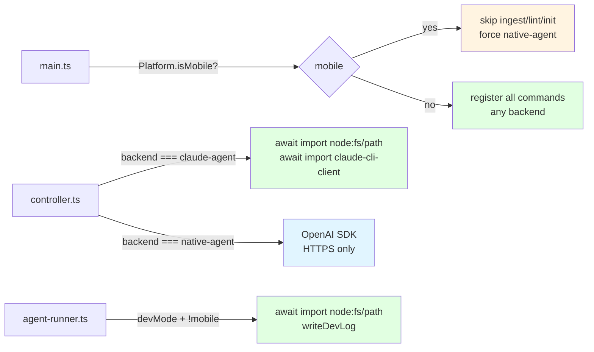
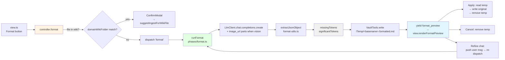

# Dependency Graph — obsidian-llm-wiki

## Component Dependencies

## Layer Legend

| Color | Layer | Modules |
|-------|-------|---------|
| Light yellow | Application (orchestration) | main.ts, controller.ts |
| Light green | Infrastructure (I/O, LLM) | agent-runner.ts, claude-cli-client.ts, phases/ |
| Light blue | Presentation (UI) | view.ts, settings.ts, modals.ts |
| Gray | Shared / Domain | types.ts, domain-map.ts, vault-tools.ts, stream.ts, source-paths.ts, i18n.ts, wiki-path.ts, phases/format-utils.ts |

## Mobile-Safe Boundary (v0.1.59+)

Импорты `node:fs`, `node:path`, `node:child_process`, `./claude-cli-client` лежат за асинхронным `await import(...)` внутри desktop-only веток. Static-test `tests/no-fs-imports.test.ts` ловит регрессии.

## Format Operation Flow (v0.1.62+)

