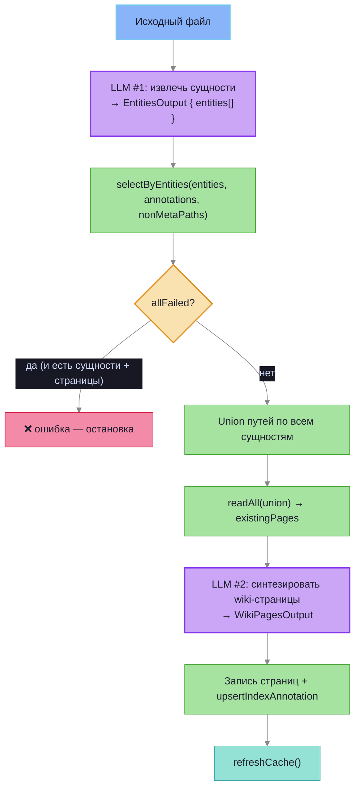
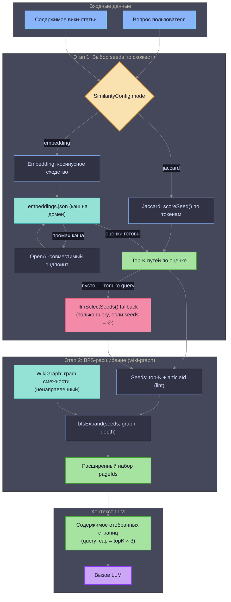

# Логика фильтрации статей

Описывает, как система выбирает ограниченный набор вики-страниц в качестве контекста LLM для операций ingest, query и lint.

## Ingest: entity-based ретривал

Ingest использует двухшаговый конвейер с предварительным извлечением сущностей — без BFS.

`selectByEntities()` — для каждой сущности (`name`, `type`, `context_snippet`) отдельно вычисляет top-K похожих страниц через Jaccard или embedding. BFS не применяется — `graphDepth` в ingest игнорируется (`void graphDepth`).

## Query и Lint: seeds + BFS

Query и lint используют двухэтапный конвейер фильтрации.

## Детали по операциям

```mermaid
%%{init: {'theme': 'base', 'themeVariables': {
  'background': '#1e1e2e',
  'primaryColor': '#313244',
  'primaryTextColor': '#cdd6f4',
  'primaryBorderColor': '#89b4fa',
  'lineColor': '#888888',
  'secondaryColor': '#181825',
  'tertiaryColor': '#45475a'
}}}%%
flowchart LR
    subgraph ingest_op["INGEST"]
        I1["Исходный файл"] --> I2["LLM: extractEntities()"]
        I2 --> I3["selectByEntities(entities,\nannotations, nonMetaPaths)"]
        I3 -->|"allFailed → halt"| I_ERR["❌"]
        I3 --> I4["union путей → readAll()"]
        I4 --> I5["LLM: WikiPagesOutput"]
        I5 --> I6["Запись + upsertAnnotation"]
        I6 --> I7["refreshCache()"]
    end

    subgraph query_op["QUERY"]
        Q1["Вопрос пользователя"] --> Q2["loadCache() + selectRelevant()\n(только аннотированные страницы)"]
        Q2 -->|"seeds найдены"| Q3["readAll() → buildGraph → BFS"]
        Q2 -->|"пусто"| Q4["llmSelectSeeds()"]
        Q4 --> Q3
        Q3 --> Q5["buildContextBlock(cap=topK×3)"]
        Q5 --> Q6["LLM: ответ"]
    end

    subgraph lint_op["LINT: цикл по статьям"]
        L1["Вики-статья"] --> L2["selectRelevant(articleContent,\nannotations, otherPaths)"]
        L2 --> L3["seeds = [articleId, ...topKIds]\nbfsExpand(seeds, graph, 1)"]
        L3 --> L4["LLM: fixes + deletes"]
        L4 --> L5["fixWikiLinks + запись"]
        L5 --> L6["Rebuild graphCache + refreshCache"]
        L6 -->|"следующая статья"| L1
    end

    classDef op_input fill:#89b4fa,color:#1e1e2e,stroke:#74c7ec,stroke-width:2px
    classDef op_llm   fill:#cba6f7,color:#1e1e2e,stroke:#8839ef,stroke-width:2px
    classDef op_write fill:#a6e3a1,color:#1e1e2e,stroke:#40a02b
    classDef op_cache fill:#94e2d5,color:#1e1e2e,stroke:#179299
    classDef op_fb    fill:#f38ba8,color:#1e1e2e,stroke:#d20f39

    class I1,Q1,L1 op_input
    class I2,I5,Q6,L4 op_llm
    class I6,L5 op_write
    class I7,L6 op_cache
    class Q4 op_fb
```

## Ключевые понятия

| Понятие | Описание |
|---|---|
| `selectRelevant()` | Точка входа выбора seeds. Используется в **query и lint** — не в ingest. Направляет в jaccard или embedding. |
| `selectByEntities()` | Точка входа ingest. Для каждой `ExtractedEntity` (name, type, context_snippet) вычисляет top-K страниц отдельно. Возвращает `EntityRetrievalResult { results, allFailed }`. |
| `allFailed` | `true`, если все entity-запросы вернули пустой результат при непустом wiki. Ingest прерывается с ошибкой. |
| `scoreSeed()` | Оценка Жаккара: `пересечение(queryTokens, pageTokens) / queryTokens.size` |
| `pageTokens` | Объединение: токены pageId + annotation (тело и frontmatter-keywords включаются только если передан content; в index-режиме content = `""`, используется только annotation). |
| `indexAnnotations` | `Map<pageId, annotation>` из `_index.md`. Лёгкое саммари для скоринга без чтения полного контента. В query: только аннотированные страницы участвуют в seed selection. |
| `bfsExpand()` | Ненаправленный BFS — обходит рёбра в обе стороны (`A→B` и `B→A`). Используется в **query и lint** — ingest не использует BFS. |
| `graphDepth` | Глубина BFS для query. Lint всегда использует `depth=1`. Ingest — не используется (`void graphDepth`). |
| `topK` | Максимум seeds из этапа схожести. В query: контекст дополнительно ограничен `topK × 3` страницами (`buildContextBlock`). |
| `refreshCache()` | Обновляет `_embeddings.json` хэшами и векторами аннотаций. Вызывается: в ingest — после записи всех страниц; в lint — после каждой статьи. |
