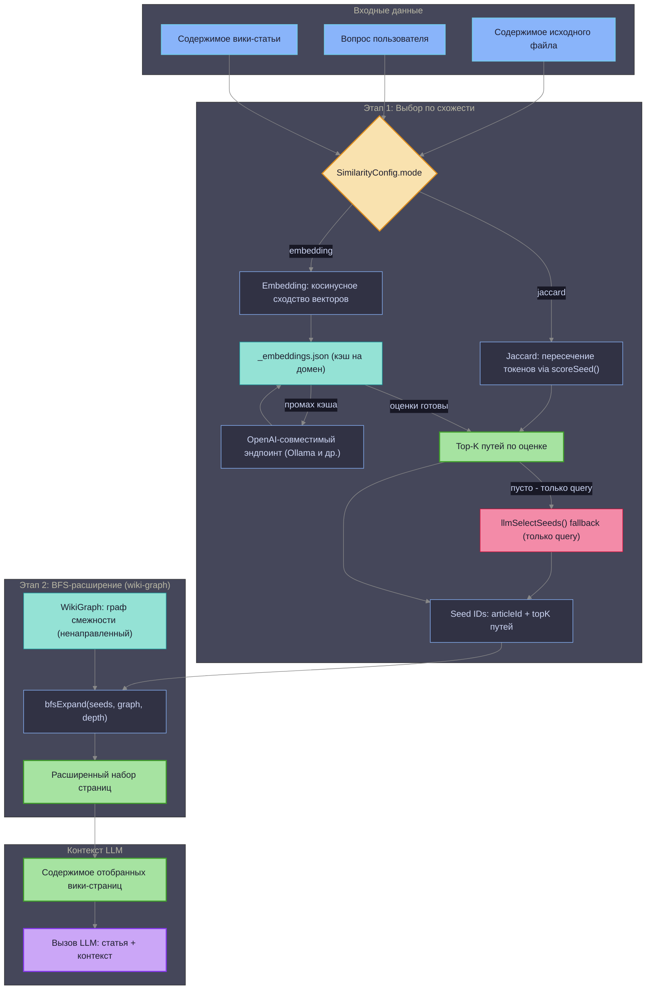
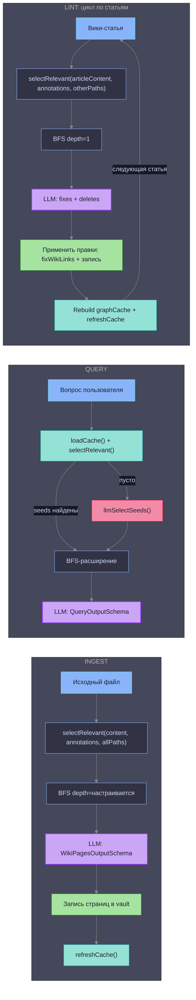

# Логика фильтрации статей

Описывает, как система выбирает ограниченный набор вики-страниц в качестве контекста LLM для операций ingest, query и lint.

## Общий конвейер

Все три операции используют единый двухэтапный конвейер фильтрации:
1. **Выбор по схожести** — отбор top-K страниц-«зёрен» по релевантности
2. **BFS-расширение** — расширение набора через связи в вики-графе

## Детали по операциям

## Ключевые понятия

| Понятие | Описание |
|---|---|
| `selectRelevant()` | Точка входа выбора по схожести. Направляет в режим jaccard или embedding. |
| `scoreSeed()` | Оценка Жаккара: `пересечение(queryTokens, pageTokens) / queryTokens.size` |
| `pageTokens` | Объединение: токены pageId + `wiki_keywords` из frontmatter + тело (500 символов) + annotation |
| `indexAnnotations` | `Map<pageId, annotation>` из `_index.md`. Лёгкое саммари страницы для скоринга без чтения полного контента. |
| `bfsExpand()` | Ненаправленный BFS — обходит рёбра в обе стороны (`A→B` и `B→A`). Симметрия по задумке. |
| `graphDepth` | Настраиваемая глубина BFS для query. Lint всегда использует `depth=1`. |
| `topK` | Максимум seeds из этапа схожести. Настраивается через `relevantPagesTopK` в `LocalConfig.nativeAgent`. |
| `refreshCache()` | Обновляет `_embeddings.json` векторами для вновь записанных страниц. Вызывается после записи в ingest и пер-статейно в lint. |
