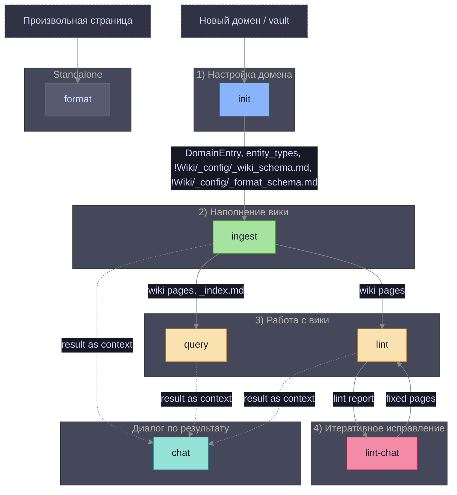
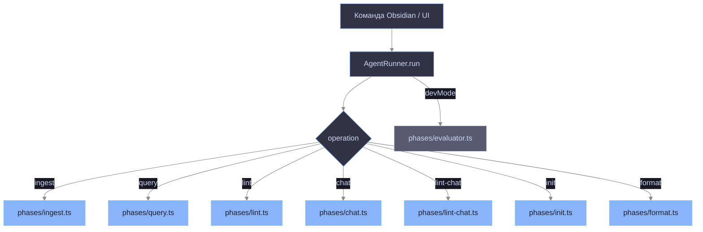
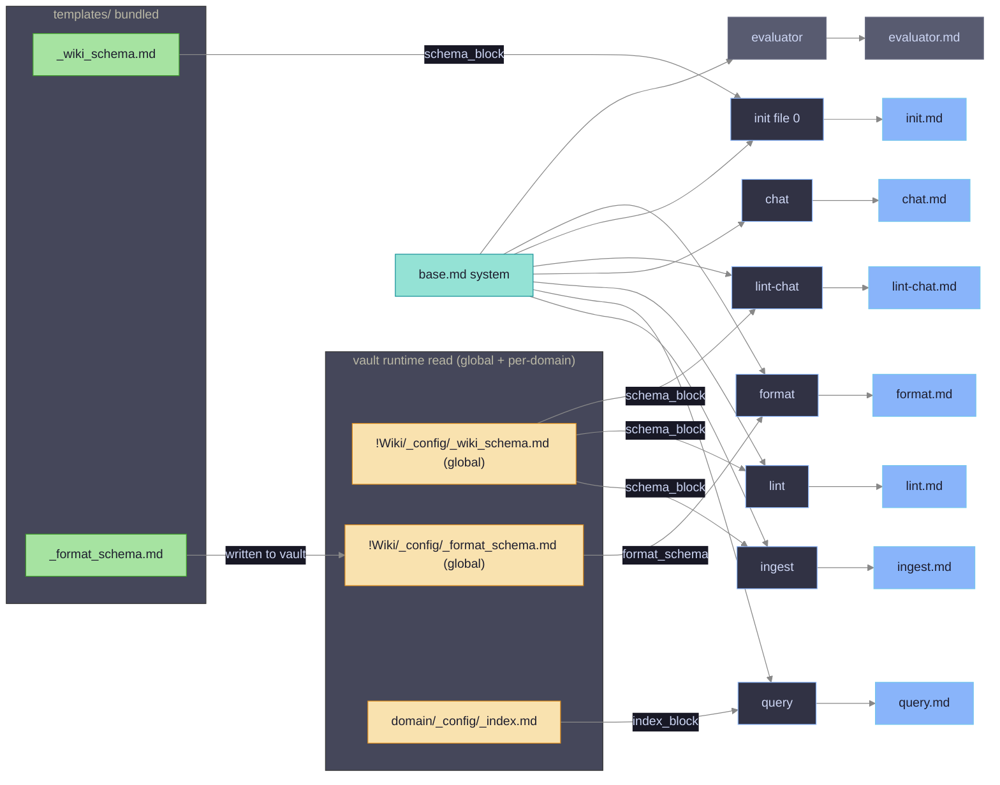
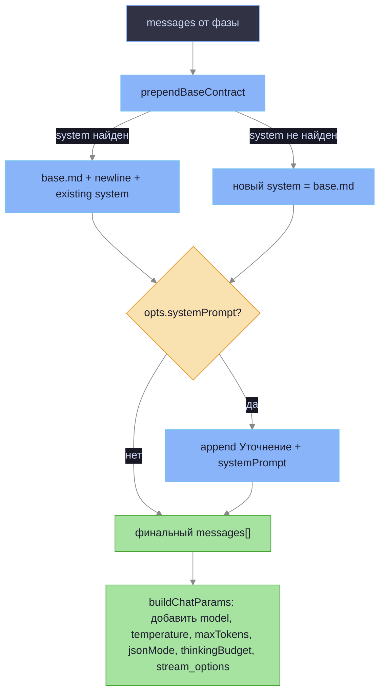
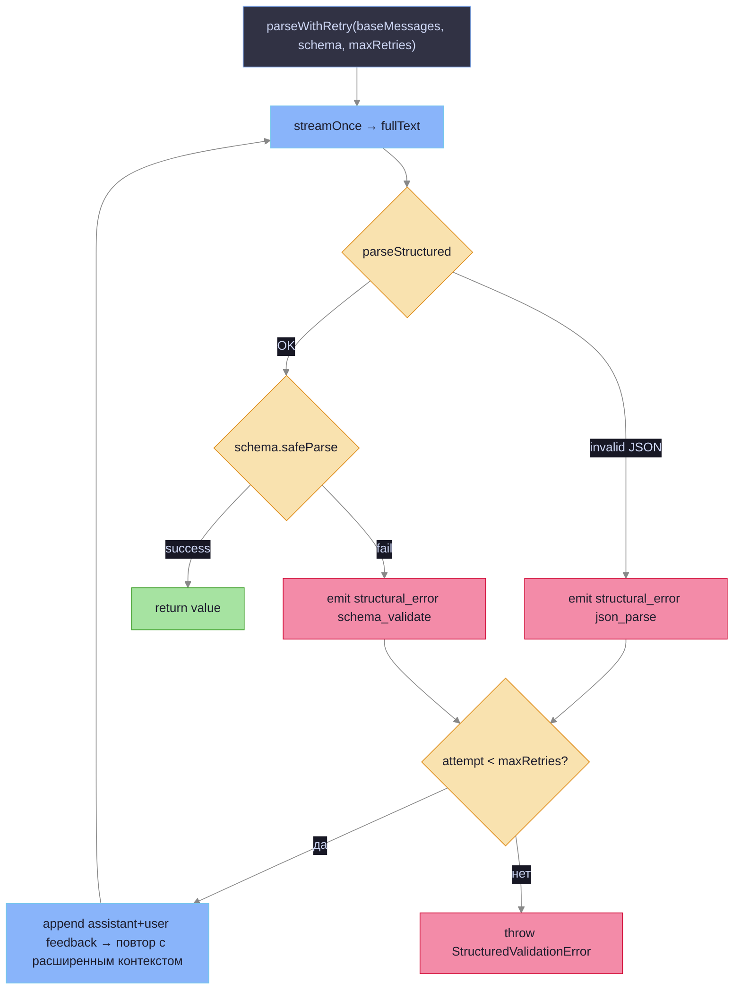

# Prompt Architecture

Схема использования промтов и шаблонов по операциям.

## Последовательность операций и зависимости



**Сплошные стрелки** — жёсткая зависимость (операция не запустится без артефакта-источника).  
**Пунктирные стрелки** — мягкая зависимость (chat берёт `context` из последнего результата; технически запустится без него, но бесполезен).

| Операция | Требует | Производит |
|---|---|---|
| **init** | — | `DomainEntry`, `entity_types`, `!Wiki/_config/_wiki_schema.md`, `!Wiki/_config/_format_schema.md` |
| **ingest** | `DomainEntry`, `_wiki_schema.md` | wiki-страницы, `_index.md` (обновление), `analyzed_sources` |
| **query** | `DomainEntry`, `_index.md`, wiki-страницы | ответ |
| **lint** | `DomainEntry`, wiki-страницы | lint-отчёт + исправленные страницы + `domain_updated` (entity_types) |
| **lint-chat** | `DomainEntry`, lint-отчёт, wiki-страницы | исправленные wiki-страницы |
| **chat** | результат любой предыдущей операции | диалог |
| **format** | произвольная страница, `_format_schema.md` | отформатированная страница |

## Routing: операция → фаза



## Промты по фазам



**Примечание:** `evaluator.md` рендерится в роль `user`, но `base.md` всё равно инжектируется как `system` через `buildChatParams → prependBaseContract` (см. ниже).

## buildChatParams: сборка сообщений

Каждый вызов LLM идёт через `buildChatParams` → формирует финальный массив `messages`:



| Опция `LlmCallOptions` | Поведение |
|---|---|
| `systemPrompt` | Добавляет секцию `## Уточнение` в конец system-сообщения |
| `jsonMode: "json_object"` | Устанавливает `response_format: { type: "json_object" }`. Автоматически снимается при `thinkingBudgetTokens > 0`. Fallback: при ошибке 400/422 с ключевыми словами "json_object" / "unsupported" — retry без `response_format` (`wrapWithJsonFallback`) |
| `thinkingBudgetTokens` | Включает thinking-режим модели; снимает `response_format`, `temperature`, `top_p` |
| `temperature`, `maxTokens`, `topP` | Прямая передача в API |
| `structuredRetries` | Число retry в `parseWithRetry` (default 1) |

## parseWithRetry: структурированный вывод с ретраем

Все операции с JSON-схемой (`ingest`, `lint`, `lint-chat`, `init`, `query.seeds`, `format`) используют `parseWithRetry` из `phases/parse-with-retry.ts`:



При retry — предыдущий ответ LLM добавляется как `assistant`, а текст ошибки Zod как `user`. LLM видит свою ошибку и исправляет структуру.

Точки вызова (`CallSite`):

| callSite | Фаза | Схема |
|---|---|---|
| `ingest.pages` | `ingest.ts` | `WikiPagesOutputSchema` |
| `init.bootstrap` | `init.ts` file 0 | `DomainEntrySchema` |
| `lint.fix` | `lint.ts` | `LintOutputSchema` |
| `lint.patch` | `lint.ts` (actualizeDomainConfig) | `EntityTypesDeltaSchema` |
| `lint-chat.fix` | `lint-chat.ts` | `LintChatSchema` |
| `query.seeds` | `query.ts` (llmSelectSeeds) | `SeedsSchema` |
| `format.output` | `format.ts` | `FormatOutputSchema` |

## Вторичные LLM-вызовы

Некоторые фазы делают более одного LLM-вызова:

### query: seed selection

```
Phase 1: читает _index.md (без файлов wiki)
Phase 2: selectSeeds — Jaccard по токенам (без LLM)
         если seeds == 0 → llmSelectSeeds (parseWithRetry, SeedsSchema)
Phase 3: читает только файлы-семена + BFS-расширение
Phase 4: основной query-вызов (streaming, free text)
```

`llmSelectSeeds` вызывается без system-сообщения → `prependBaseContract` добавляет `base.md` как system.

### lint: actualizeDomainConfig

После основного lint-вызова (единый CoT+Structured вызов через `parseWithRetry, LintOutputSchema`) — отдельный вызов `actualizeDomainConfig`:
- анализирует реальный контент wiki vs текущий `entity_types`
- возвращает дельту (`EntityTypesDeltaSchema`)
- эмитирует `domain_updated` — контроллер сохраняет в domain-map

### ingest: entity_types_delta

Если LLM возвращает `entity_types_delta` в ответе:
- `mergeEntityTypes(domain.entity_types, delta)` — merge по ключу `type`
- эмитирует `domain_updated { domainId, patch: { entity_types: merged } }`
- контроллер сохраняет патч; `runInitWithSources` интерцептирует событие для обновления `currentDomain` перед следующим файлом

### ingest: retry invalid paths

При получении страниц с нарушением правила 4 сегментов:
- `retryInvalidPaths` — отдельный `buildChatParams`-вызов (free text)
- передаёт оригинальные messages + ошибку как user-сообщение
- ожидает JSON-массив только для невалидных путей

## Контекст, инжектируемый в каждый промт

| Операция | Промт | Переменные `render()` | Схема ответа |
|---|---|---|---|
| **ingest** | `ingest.md` + `base.md` | `domain_name`, `entity_types_block`, `lang_notes`, `wiki_path`, `today`, `schema_block`, `source_path` | `WikiPagesOutputSchema` `{reasoning, pages[{path,content,annotation?}], entity_types_delta?}` |
| **query** | `query.md` + `base.md` | `domain_name`, `entity_types_block`, `index_block` | free text |
| **lint** | `lint.md` + `base.md` | `domain_name`, `entity_types_block`, `schema_block` | `LintOutputSchema` `{reasoning, report, fixes[{path,content,annotation?}]}` |
| **chat** | `chat.md` + `base.md` | `operation_header`, `context` | free text |
| **lint-chat** | `lint-chat.md` + `base.md` | `domain_name`, `lint_report`, `pages_block`, `schema_block` | `LintChatSchema` `{summary, pages[{path,content,annotation?}]}` |
| **init** file 0 | `init.md` + `base.md` | `domain_id`, `vault_name`, `schema_block`, `index_block` | `DomainEntrySchema` `{reasoning,id,name,wiki_folder,entity_types,language_notes}` |
| **format** | `format.md` + `base.md` | `format_schema`, `has_vision` | `FormatOutputSchema` `{report, formatted}` |
| **evaluator** _(devMode)_ | `base.md` + `evaluator.md` | `operation`, `task_input`, `result` _(user role; base инжектируется как system через buildChatParams)_ | `{score:0-10, reasoning}` |

## Сравнительная таблица промтов

| Промт | Используется в | Задача | Проблемы / противоречия |
|---|---|---|---|
| `base.md` | Все операции (system, prepend через `prependBaseContract`) | Базовый контракт: достоверность, формат, минимализм | Применяется ко ВСЕМ вызовам включая evaluator — `buildChatParams` всегда вставляет `base.md` в system |
| `ingest.md` | `ingest` | Извлечение экземпляров сущностей из источника → wiki-страницы + обогащение `entity_types` через `entity_types_delta?` | — |
| `query.md` | `query` | Ответ на вопрос по wiki-индексу домена | Нет явного ограничения на длину ответа; при большом `index_block` контекст разрастается |
| `lint.md` | `lint` | Единый CoT+Structured вызов: анализ качества wiki + автоисправление страниц в одном ответе | — |
| `lint-chat.md` | `lint-chat` | Интерактивное исправление по lint-отчёту; читает `_wiki_schema.md` → `schema_block` | — |
| `chat.md` | `chat` | Свободный диалог по результатам операции | Не специфичен для домена: нет `entity_types_block`, `schema_block`. Контекст только через `{{context}}` |
| `init.md` | `init`, файл 0 (bootstrap) | Создание полной записи домена (`entity_types`, `wiki_folder`, …) | — |
| `format.md` | `format` | Форматирование произвольной markdown-страницы | Не связан с доменной wiki — намеренно. Дублирует часть правил из `_format_schema.md` |
| `evaluator.md` | `agent-runner`, devMode | Оценка качества результата операции (score 0–10) | Рендерится в роль `user`, но `base.md` применяется как `system` через `buildChatParams`. Вызывается после каждой операции при devMode |
| `_wiki_schema.md` | `init` (bundled), `ingest`/`lint`/`lint-chat` (vault read) | Конвенции wiki-страниц: frontmatter, структура, стиль. Путь: `!Wiki/_config/_wiki_schema.md` (shared by all domains) | Изменения в bundled-шаблоне не попадают в существующие vaults автоматически |
| `_format_schema.md` | `init` (bundled, записывается в vault), `format` (vault read) | Конвенции форматирования не-wiki страниц. Путь: `!Wiki/_config/_format_schema.md` (shared by all domains) | При `init` пишется в vault как дефолт — изменения в `templates/` не обновляют существующие vaults |

## Замечания для архитектурного анализа

### wrapWithJsonFallback — прозрачный retry без json_object

`AgentRunner` оборачивает переданный `LlmClient` в `wrapWithJsonFallback` (`agent-runner.ts:23`): если LLM вернул 400/422 с упоминанием "json_object" / "unsupported", запрос повторяется без `response_format`. Активируется только при `opts.jsonMode === "json_object"`. Позволяет один и тот же код работать с моделями без поддержки structured output.

## PageSimilarityService — выбор релевантных страниц

`PageSimilarityService` (`src/page-similarity.ts`) решает проблему O(N²) загрузки всех wiki-страниц в `runIngest`: вместо передачи всего wiki в контекст LLM выбираются только top-K наиболее релевантных страниц.

### Два режима работы

| Режим | Метод отбора | Требования |
|---|---|---|
| `jaccard` | Jaccard-оценка пересечения токенов source-файла и аннотаций из `_index.md` | — |
| `embedding` | Косинусное сходство векторов через OpenAI-совместимый `/embeddings` endpoint | `embeddingModel`, `embeddingDimensions`, API-ключ |

В режиме `embedding` при недоступности API автоматически применяется Jaccard как fallback. Запросы к API выполняются батчами по 100 элементов.

### Кэш эмбеддингов

Векторы страниц хранятся в `!Wiki/<domain>/_config/_embeddings.json`. Структура:

```json
{
  "model": "text-embedding-3-small",
  "dimensions": 1536,
  "entries": {
    "<pageId>": { "vector": "<base64 Float32Array>", "hash": "<annotation hash>" }
  }
}
```

Кэш инвалидируется при изменении аннотации страницы (по хэшу контента). При смене модели или числа измерений весь кэш пересоздаётся. `refreshCache` обновляет только устаревшие записи — вызывается в `runLint` и `runFormat` после записи домена.

### Подключение к фазам через AgentRunner

`AgentRunner.buildSimilarity()` создаёт единственный экземпляр `PageSimilarityService` на запрос и передаёт его во все фазы:

| Фаза | Использование |
|---|---|
| `ingest` | `selectRelevant()` перед формированием контекста для LLM |
| `init` | `selectRelevant()` для файлов после первого (ingest-pass) |
| `lint` | `refreshCache()` после прохода по домену |
| `format` | `refreshCache()` после записи страниц |

Сервис активен только при `backend = "native-agent"`. При `backend = "claude-agent"` `buildSimilarity()` возвращает `undefined`, фазы получают весь контент без фильтрации.

### Прогресс-шаг выбора страниц

После `selectRelevant()` фаза `ingest` эмитирует событие `info_text` (тип `RunEvent`):

```typescript
{ kind: "info_text", icon: "🔍" | "📋", summary: "N/M wiki-pages loaded (mode)", details: string[] }
```

`view.ts` рендерит его как отдельный step-item с иконкой и списком entity-names (значений `pageId(path)` для каждого выбранного файла). Иконка: `🔍` для embedding-режима, `📋` для jaccard.

### Настройки (`LocalConfig.nativeAgent`)

| Поле | Тип | Назначение |
|---|---|---|
| `embeddingModel` | `string?` | Модель эмбеддингов. `undefined` = jaccard; `""` (пустая строка) = режим включён, модель не задана → jaccard до ввода имени; непустая строка = embedding-режим |
| `embeddingDimensions` | `number?` | Число измерений; обязательно при `embeddingModel` |
| `relevantPagesTopK` | `number?` | Максимум страниц в контексте (default: 15) |

**Поведение UI-тоггла "Enable semantic similarity":**
- Toggle OFF → `embeddingModel: undefined, embeddingDimensions: undefined`. Поля модели скрыты.
- Toggle ON → `embeddingModel: ""` (sentinel). Поля "Embedding model" и "Embedding dimensions" появляются. Режим остаётся jaccard до ввода имени модели.

Поля хранятся в `local.json` (не синхронизируются между устройствами).
