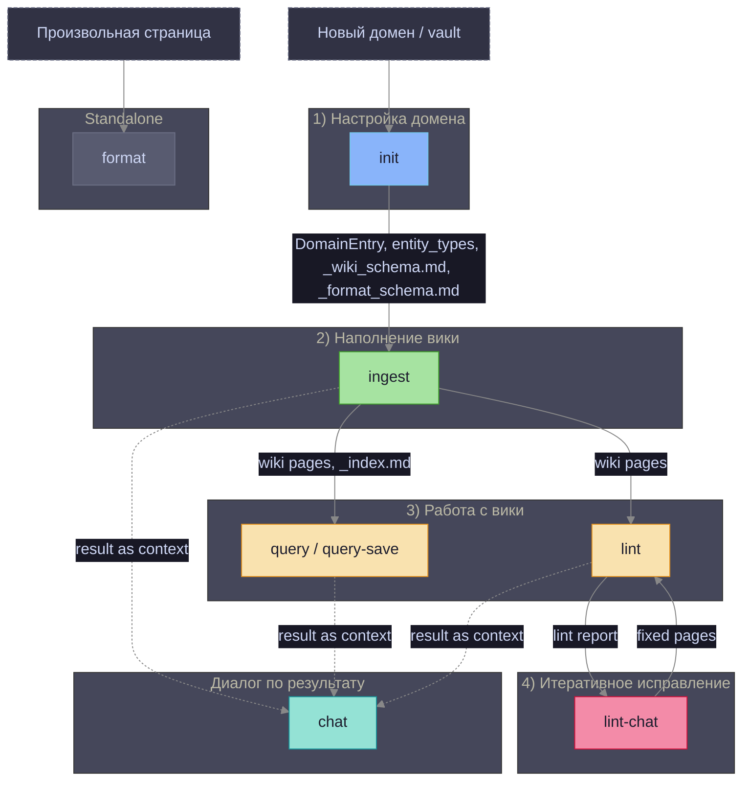
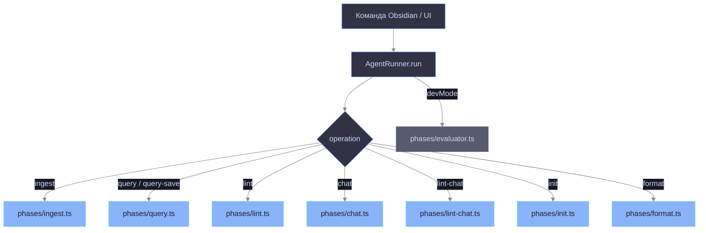
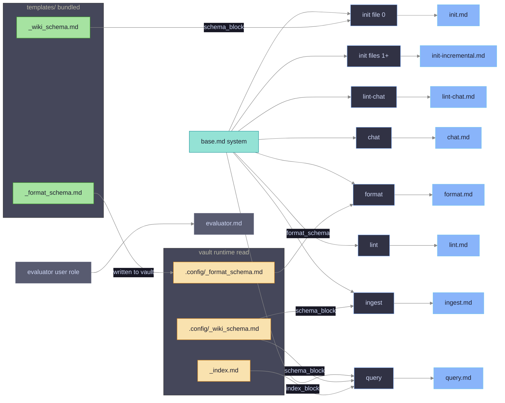

# Prompt Architecture

Схема использования промтов и шаблонов по операциям.

## Последовательность операций и зависимости

**Сплошные стрелки** — жёсткая зависимость (операция не запустится без артефакта-источника).  
**Пунктирные стрелки** — мягкая зависимость (chat берёт `context` из последнего результата; технически запустится без него, но бесполезен).

| Операция | Требует | Производит |
|---|---|---|
| **init** | — | `DomainEntry`, `entity_types`, `_wiki_schema.md`, `_format_schema.md` |
| **ingest** | `DomainEntry`, `_wiki_schema.md` | wiki-страницы, `_index.md` (обновление), `analyzed_sources` |
| **query / query-save** | `DomainEntry`, `_index.md`, wiki-страницы | ответ / `Q-*.md` |
| **lint** | `DomainEntry`, wiki-страницы | lint-отчёт |
| **lint-chat** | `DomainEntry`, lint-отчёт, wiki-страницы | исправленные wiki-страницы |
| **chat** | результат любой предыдущей операции | диалог |
| **format** | произвольная страница, `_format_schema.md` | отформатированная страница |

## Routing: операция → фаза

## Промты по фазам

## Контекст, инжектируемый в каждый промт

| Операция | Промт | Переменные `render()` | Схема ответа |
|---|---|---|---|
| **ingest** | `ingest.md` + `base.md` | `domain_name`, `entity_types_block`, `lang_notes`, `wiki_path`, `today`, `schema_block`, `source_path` | `WikiPagesOutputSchema` `{reasoning, pages[{path,content,annotation}]}` |
| **query** | `query.md` + `base.md` | `domain_name`, `entity_types_block`, `schema_block`, `index_block` | free text |
| **lint** | `lint.md` + `base.md` | `domain_name`, `entity_types_block` | `LintOutputSchema` `{reasoning, report, fixes[]}` |
| **chat** | `chat.md` + `base.md` | `operation_header`, `context` | free text |
| **lint-chat** | `lint-chat.md` + `base.md` | `domain_name`, `lint_report`, `pages_block` | `LintChatSchema` `{summary, pages[{path,content,annotation?}]}` |
| **init** file 0 | `init.md` + `base.md` | `domain_id`, `vault_name`, `schema_block`, `index_block` | `DomainEntrySchema` `{reasoning,id,name,wiki_folder,entity_types,language_notes}` |
| **init** files 1…N | `init-incremental.md` + `base.md` | _(нет render — сырой текст)_ | `EntityTypesDeltaSchema` `{reasoning, entity_types?, language_notes?}` |
| **format** | `format.md` + `base.md` | `format_schema`, `has_vision` | `FormatOutputSchema` `{report, formatted}` |
| **evaluator** _(devMode)_ | `evaluator.md` | `operation`, `task_input`, `result` _(user role, base не применяется)_ | `{score:0-10, reasoning}` |

## Сравнительная таблица промтов

| Промт | Используется в | Задача | Проблемы / противоречия |
|---|---|---|---|
| `base.md` | Все операции (system, prepend) | Базовый контракт: достоверность, формат, минимализм | Не применяется к `evaluator` — его роль `user`. Исключение намеренное, но нигде не задокументировано |
| `ingest.md` | `ingest` | Извлечение экземпляров сущностей из источника → wiki-страницы | Не обогащает `entity_types` при обнаружении новых типов. Приходится запускать `init` заново. Потенциальное слияние с логикой `init-incremental.md` |
| `query.md` | `query`, `query-save` | Ответ на вопрос по wiki-индексу домена | Нет явного ограничения на длину ответа; при большом `index_block` контекст разрастается неконтролируемо |
| `lint.md` | `lint` | Анализ качества wiki + автоисправление страниц | Не получает `schema_block` — LLM не видит конвенции `_wiki_schema.md` при проверке. `lint.ts` добавляет JSON-пример динамически в коде (`buildRetrySystemPrompt`), а не в промте — разрыв между промтом и поведением |
| `lint-chat.md` | `lint-chat` | Интерактивное исправление по lint-отчёту | Схема ответа не включала `annotation` — код (`lint-chat.ts:87`) ждал его, но LLM не возвращал. **Исправлено.** |
| `chat.md` | `chat` | Свободный диалог по результатам операции | Промт не специфичен для домена — не получает `entity_types_block` и `schema_block`. Контекст только через `{{context}}` (результат предыдущей операции) |
| `init.md` | `init`, файл 0 (bootstrap) | Создание полной записи домена (`entity_types`, `wiki_folder`, …) | В примере `wiki_folder` показывал `"{{domain_id}}"` вместо корректного формата. **Исправлено.** Секция "Wiki Page Conventions" дублировала содержимое `init-incremental.md` с незначительными расхождениями. **Синхронизировано.** |
| `init-incremental.md` | `init`, файлы 1…N (delta) | Обнаружение новых типов сущностей в домене | Вызывается без `render()` — LLM не получает `schema_block`, `vault_name`. Правило "Никаких других полей" противоречило наличию `reasoning`. **Исправлено.** Задача пересекается с потребностью `ingest` обогащать `entity_types` |
| `format.md` | `format` | Форматирование произвольной markdown-страницы | Не связан с доменной wiki — намеренно. Дублирует правила из `_format_schema.md` (часть хардкода в промте, часть в шаблоне) |
| `evaluator.md` | `agent-runner`, devMode | Оценка качества результата операции (score 0–10) | Рендерится в роль `user`, не `system` — единственный промт с такой ролью. `base.md` не применяется. Вызывается после каждой операции при включённом devMode |
| `_wiki_schema.md` | `init` (bundled), `ingest`/`query` (vault read) | Конвенции wiki-страниц: frontmatter, структура, стиль | Отсутствовало поле `wiki_keywords` — оно упоминалось во всех операционных промтах, но не было в схеме. **Исправлено: заменено на `tags`.** Пример папок доменов содержал кириллицу при правиле "латиница". **Исправлено.** |
| `_format_schema.md` | `init` (bundled, записывается в vault), `format` (vault read) | Конвенции форматирования не-wiki страниц | Правило `tags` было расплывчатым. **Исправлено.** При `init` шаблон записывается в vault как дефолт — изменения в `templates/` не попадают в существующие vaults автоматически |

## Замечания для архитектурного анализа

### init-incremental vs ingest — потенциальное слияние

`init-incremental.md` обнаруживает **типы** сущностей (мета-уровень).  
`ingest.md` извлекает **экземпляры** по известным типам (объектный уровень).

Сейчас это два отдельных прохода: сначала `init` строит каталог `entity_types`, потом `ingest` пишет страницы.

**Идея:** дать `ingest` возможность обогащать `entity_types` инкрементально при каждом запуске.  
Для этого потребуется:
1. Добавить `entity_types_delta?` в `WikiPagesOutputSchema`
2. Обновить `ingest.md` — попросить LLM возвращать дельту при обнаружении новых типов
3. Прокинуть сохранение домена в `ingest.ts` (сейчас `DomainStore` недоступен из фазы)

### init-incremental.md — не получает schema_block

В отличие от `init.md`, `initIncrementalTemplate` вызывается без `render()` — LLM не видит конвенции `_wiki_schema.md` при delta-обновлении типов.

### evaluator — изолирован от base.md

`evaluator.md` рендерится в `user` роль и не проходит через `injectBaseContract` — намеренно, чтобы не смешивать инструкции wiki-агента с инструкциями оценщика.
