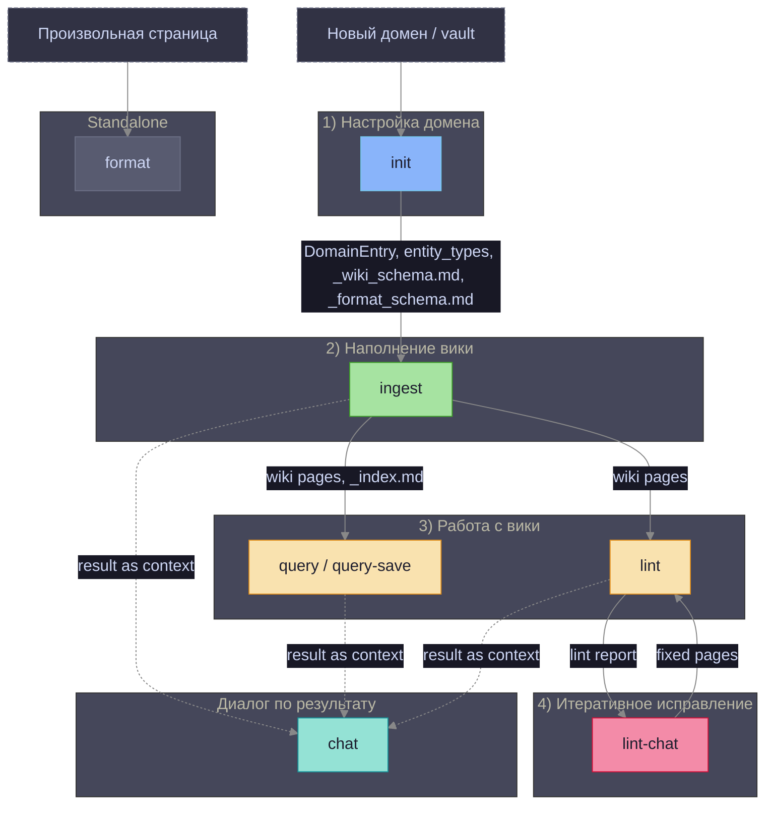
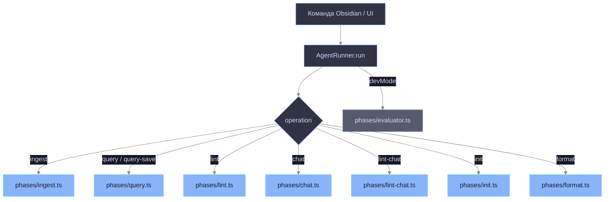
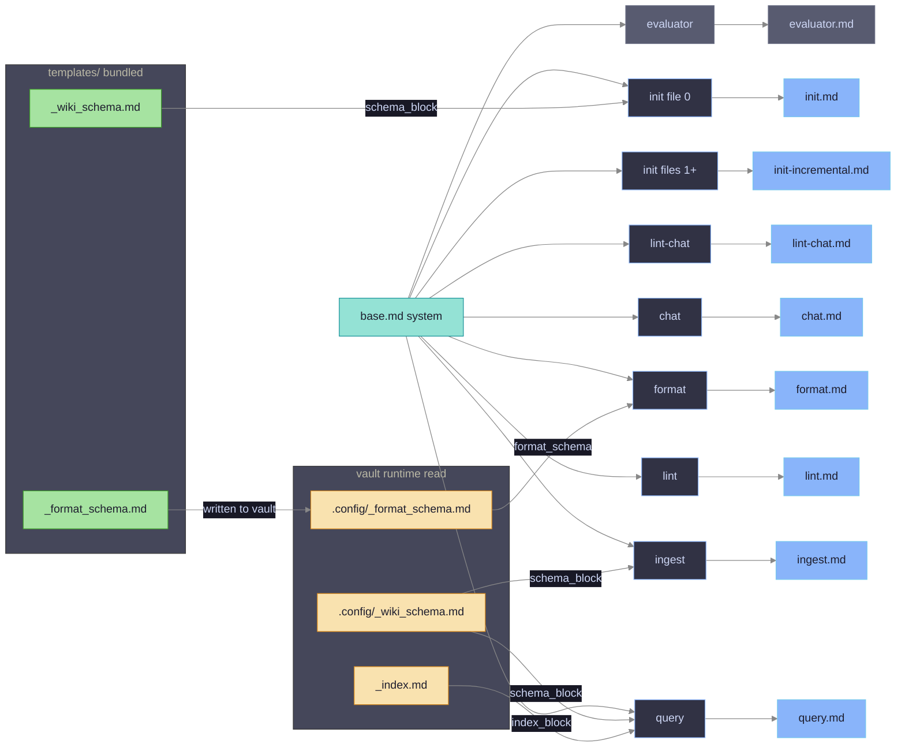
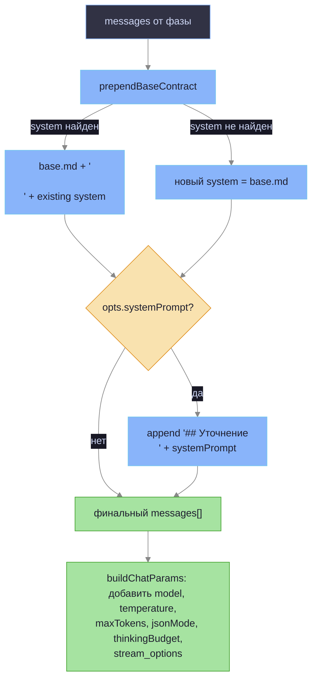
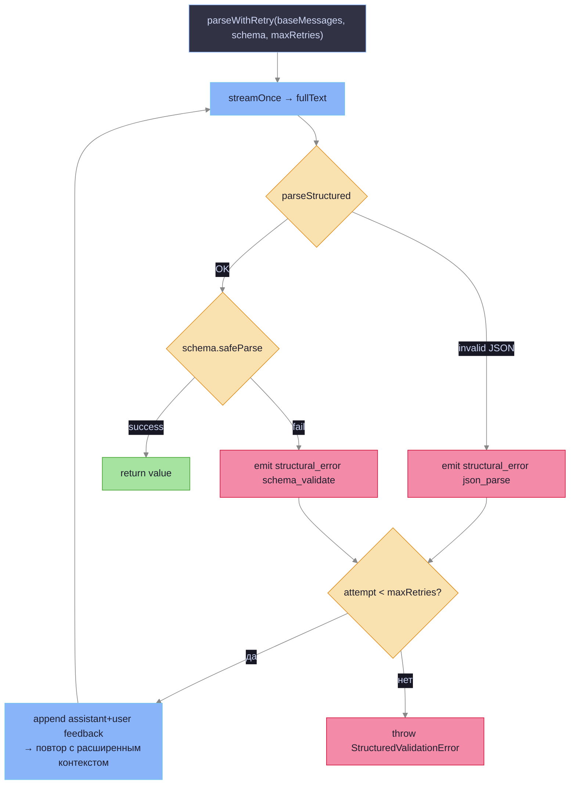

# Prompt Architecture

Схема использования промтов и шаблонов по операциям.

## Последовательность операций и зависимости



**Сплошные стрелки** — жёсткая зависимость (операция не запустится без артефакта-источника).  
**Пунктирные стрелки** — мягкая зависимость (chat берёт `context` из последнего результата; технически запустится без него, но бесполезен).

| Операция | Требует | Производит |
|---|---|---|
| **init** | — | `DomainEntry`, `entity_types`, `_wiki_schema.md`, `_format_schema.md` |
| **ingest** | `DomainEntry`, `_wiki_schema.md` | wiki-страницы, `_index.md` (обновление), `analyzed_sources` |
| **query / query-save** | `DomainEntry`, `_index.md`, wiki-страницы | ответ / `Q-*.md` |
| **lint** | `DomainEntry`, wiki-страницы | lint-отчёт + `domain_updated` (entity_types) |
| **lint-chat** | `DomainEntry`, lint-отчёт, wiki-страницы | исправленные wiki-страницы |
| **chat** | результат любой предыдущей операции | диалог |
| **format** | произвольная страница, `_format_schema.md` | отформатированная страница |

## Routing: операция → фаза



## Промты по фазам



**Примечание:** `evaluator.md` рендерится в роль `user`, но `base.md` всё равно инжектируется как `system` через `buildChatParams → prependBaseContract` (см. ниже).

## buildChatParams: сборка сообщений

Каждый вызов LLM идёт через `buildChatParams` → формирует финальный массив `messages`:



| Опция `LlmCallOptions` | Поведение |
|---|---|
| `systemPrompt` | Добавляет секцию `## Уточнение` в конец system-сообщения |
| `jsonMode: "json_object"` | Устанавливает `response_format: { type: "json_object" }`. Автоматически снимается при `thinkingBudgetTokens > 0`. Fallback: при ошибке 400/422 с ключевыми словами "json_object" / "unsupported" — retry без `response_format` (`wrapWithJsonFallback`) |
| `thinkingBudgetTokens` | Включает thinking-режим модели; снимает `response_format`, `temperature`, `top_p` |
| `temperature`, `maxTokens`, `topP` | Прямая передача в API |
| `structuredRetries` | Число retry в `parseWithRetry` (default 1) |

## parseWithRetry: структурированный вывод с ретраем

Все операции с JSON-схемой (`ingest`, `lint`, `init`, `query.seeds`, `format`) используют `parseWithRetry` из `phases/parse-with-retry.ts`:



При retry — предыдущий ответ LLM добавляется как `assistant`, а текст ошибки Zod как `user`. LLM видит свою ошибку и исправляет структуру.

Точки вызова (`CallSite`):

| callSite | Фаза | Схема |
|---|---|---|
| `ingest.pages` | `ingest.ts` | `WikiPagesOutputSchema` |
| `init.bootstrap` | `init.ts` file 0 | `DomainEntrySchema` |
| `init.delta` | `init.ts` files 1+ | `EntityTypesDeltaSchema` |
| `lint.fix` | `lint.ts` | `LintOutputSchema` |
| `lint.patch` | `lint.ts` (actualizeDomainConfig) | `EntityTypesDeltaSchema` |
| `lint-chat.fix` | `lint-chat.ts` | `LintChatSchema` |
| `query.seeds` | `query.ts` (llmSelectSeeds) | `SeedsSchema` |
| `format.output` | `format.ts` | `FormatOutputSchema` |

## Вторичные LLM-вызовы

Некоторые фазы делают более одного LLM-вызова:

### query: seed selection

```
Phase 1: читает _index.md (без файлов wiki)
Phase 2: selectSeeds — Jaccard по токенам (без LLM)
         если seeds == 0 → llmSelectSeeds (parseWithRetry, SeedsSchema)
Phase 3: читает только файлы-семена + BFS-расширение
Phase 4: основной query-вызов (streaming, free text)
```

`llmSelectSeeds` вызывается без system-сообщения → `prependBaseContract` добавляет `base.md` как system.

### lint: actualizeDomainConfig

После основного lint-вызова — отдельный вызов `actualizeDomainConfig`:
- анализирует реальный контент wiki vs текущий `entity_types`
- возвращает дельту (`EntityTypesDeltaSchema`)
- эмитирует `domain_updated` — контроллер сохраняет в domain-map

### ingest: retry invalid paths

При получении страниц с нарушением правила 4 сегментов:
- `retryInvalidPaths` — отдельный `buildChatParams`-вызов (free text)
- передаёт оригинальные messages + ошибку как user-сообщение
- ожидает JSON-массив только для невалидных путей

## Контекст, инжектируемый в каждый промт

| Операция | Промт | Переменные `render()` | Схема ответа |
|---|---|---|---|
| **ingest** | `ingest.md` + `base.md` | `domain_name`, `entity_types_block`, `lang_notes`, `wiki_path`, `today`, `schema_block`, `source_path` | `WikiPagesOutputSchema` `{reasoning, pages[{path,content,annotation}]}` |
| **query** | `query.md` + `base.md` | `domain_name`, `entity_types_block`, `schema_block`, `index_block` | free text |
| **lint** | `lint.md` + `base.md` | `domain_name`, `entity_types_block` | `LintOutputSchema` `{reasoning, report, fixes[]}` |
| **chat** | `chat.md` + `base.md` | `operation_header`, `context` | free text |
| **lint-chat** | `lint-chat.md` + `base.md` | `domain_name`, `lint_report`, `pages_block` | `LintChatSchema` `{summary, pages[{path,content,annotation?}]}` |
| **init** file 0 | `init.md` + `base.md` | `domain_id`, `vault_name`, `schema_block`, `index_block` | `DomainEntrySchema` `{reasoning,id,name,wiki_folder,entity_types,language_notes}` |
| **init** files 1…N | `init-incremental.md` + `base.md` | _(нет переменных — render не нужен)_ | `EntityTypesDeltaSchema` `{reasoning, entity_types?, language_notes?}` |
| **format** | `format.md` + `base.md` | `format_schema`, `has_vision` | `FormatOutputSchema` `{report, formatted}` |
| **evaluator** _(devMode)_ | `base.md` + `evaluator.md` | `operation`, `task_input`, `result` _(user role; base инжектируется как system через buildChatParams)_ | `{score:0-10, reasoning}` |

## Сравнительная таблица промтов

| Промт | Используется в | Задача | Проблемы / противоречия |
|---|---|---|---|
| `base.md` | Все операции (system, prepend через `prependBaseContract`) | Базовый контракт: достоверность, формат, минимализм | Применяется ко ВСЕМ вызовам включая evaluator — `buildChatParams` всегда вставляет `base.md` в system |
| `ingest.md` | `ingest` | Извлечение экземпляров сущностей из источника → wiki-страницы | Не обогащает `entity_types` при обнаружении новых типов. Нужен отдельный `init`. Потенциальное слияние с `init-incremental.md` |
| `query.md` | `query`, `query-save` | Ответ на вопрос по wiki-индексу домена | Нет явного ограничения на длину ответа; при большом `index_block` контекст разрастается |
| `lint.md` | `lint` | Анализ качества wiki + автоисправление страниц | Не получает `schema_block` — LLM не видит конвенции `_wiki_schema.md` при проверке |
| `lint-chat.md` | `lint-chat` | Интерактивное исправление по lint-отчёту | Схема ответа не включала `annotation` — код (`lint-chat.ts`) ждал его, но LLM не возвращал. **Исправлено.** |
| `chat.md` | `chat` | Свободный диалог по результатам операции | Не специфичен для домена: нет `entity_types_block`, `schema_block`. Контекст только через `{{context}}` |
| `init.md` | `init`, файл 0 (bootstrap) | Создание полной записи домена (`entity_types`, `wiki_folder`, …) | В примере `wiki_folder` показывал `"{{domain_id}}"` вместо корректного формата. **Исправлено.** |
| `init-incremental.md` | `init`, файлы 1…N (delta) | Обнаружение новых типов сущностей в домене | Не содержит `{{переменных}}` — `render()` не нужен. Задача пересекается с потребностью `ingest` обогащать `entity_types` |
| `format.md` | `format` | Форматирование произвольной markdown-страницы | Не связан с доменной wiki — намеренно. Дублирует часть правил из `_format_schema.md` |
| `evaluator.md` | `agent-runner`, devMode | Оценка качества результата операции (score 0–10) | Рендерится в роль `user`, но `base.md` применяется как `system` через `buildChatParams`. Вызывается после каждой операции при devMode |
| `_wiki_schema.md` | `init` (bundled), `ingest`/`query` (vault read) | Конвенции wiki-страниц: frontmatter, структура, стиль | Изменения в bundled-шаблоне не попадают в существующие vaults автоматически |
| `_format_schema.md` | `init` (bundled, записывается в vault), `format` (vault read) | Конвенции форматирования не-wiki страниц | При `init` пишется в vault как дефолт — изменения в `templates/` не обновляют существующие vaults |

## Замечания для архитектурного анализа

### init-incremental vs ingest — потенциальное слияние

`init-incremental.md` обнаруживает **типы** сущностей (мета-уровень).  
`ingest.md` извлекает **экземпляры** по известным типам (объектный уровень).

Сейчас два прохода: `init` строит `entity_types`, `ingest` пишет страницы.

**Идея:** дать `ingest` возможность обогащать `entity_types` инкрементально:
1. Добавить `entity_types_delta?` в `WikiPagesOutputSchema`
2. Обновить `ingest.md` — попросить LLM возвращать дельту при новых типах
3. Прокинуть сохранение домена в `ingest.ts` (сейчас `DomainStore` недоступен из фазы)

### lint.md — не получает schema_block

В отличие от `ingest` и `query`, `lint.ts` не читает `.config/_wiki_schema.md` и не передаёт `schema_block` в промт. LLM проверяет wiki без знания конвенций.

### init-incremental.md — не содержит переменных render()

Шаблон не имеет `{{...}}` заполнителей — изменение поведения через `render()` невозможно без добавления переменных в шаблон.

### evaluator + base.md — не изолирован

Старый комментарий "base.md не применяется к evaluator" — неверен. `buildChatParams` вызывается в `evaluator.ts` с messages без system-сообщения, поэтому `prependBaseContract` создаёт `system = base.md`. `evaluator.md` при этом идёт в `user` роль — это уникально, но base.md всё равно присутствует в запросе.

### wrapWithJsonFallback — прозрачный retry без json_object

`AgentRunner` оборачивает переданный `LlmClient` в `wrapWithJsonFallback` (`agent-runner.ts:23`): если LLM вернул 400/422 с упоминанием "json_object" / "unsupported", запрос повторяется без `response_format`. Активируется только при `opts.jsonMode === "json_object"`. Позволяет один и тот же код работать с моделями без поддержки structured output.
