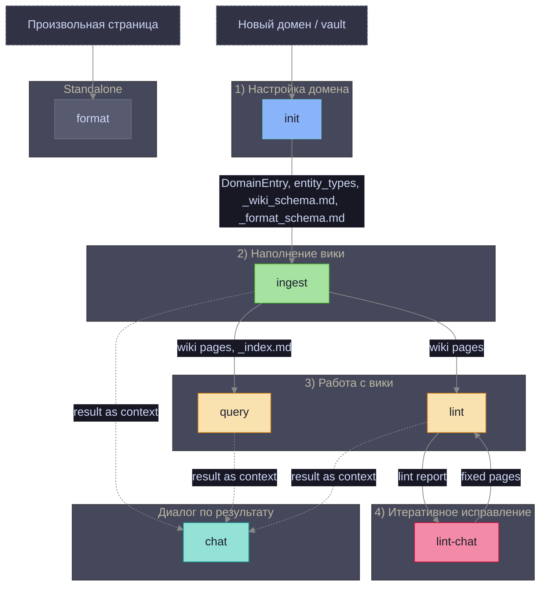
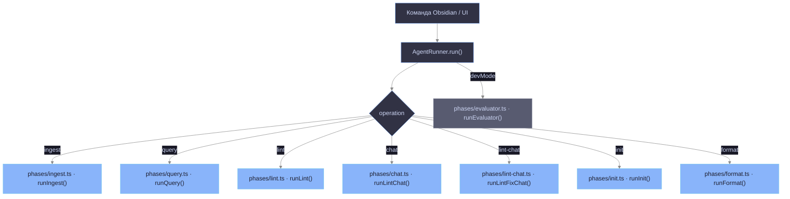
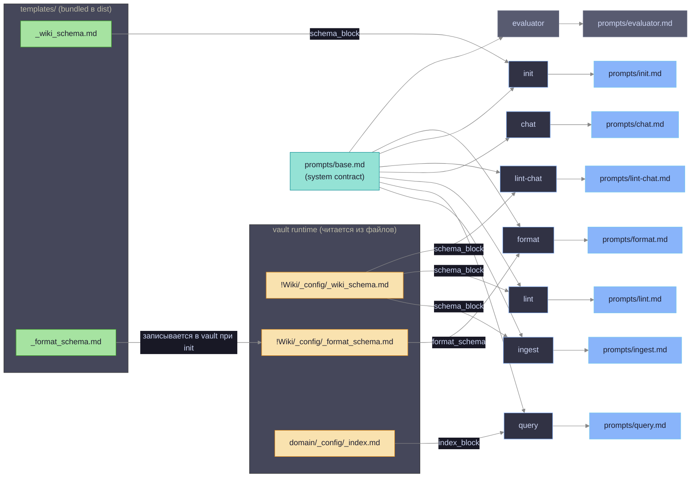
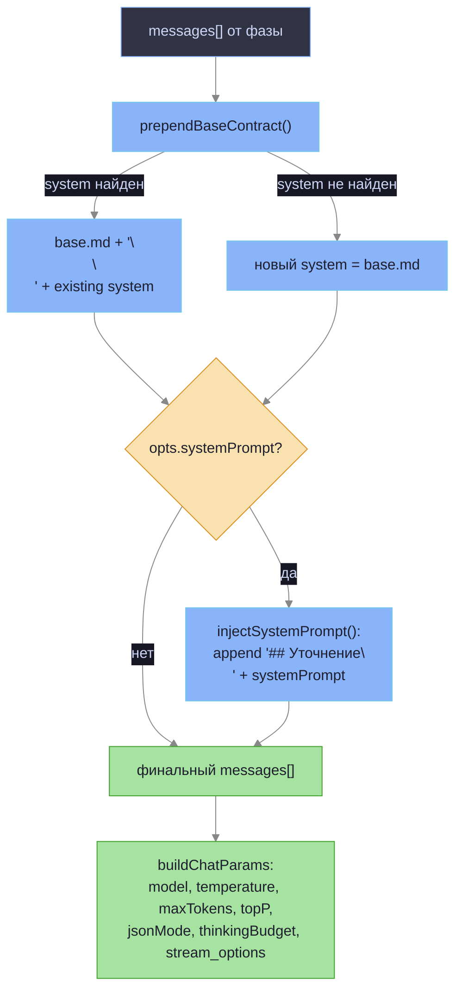
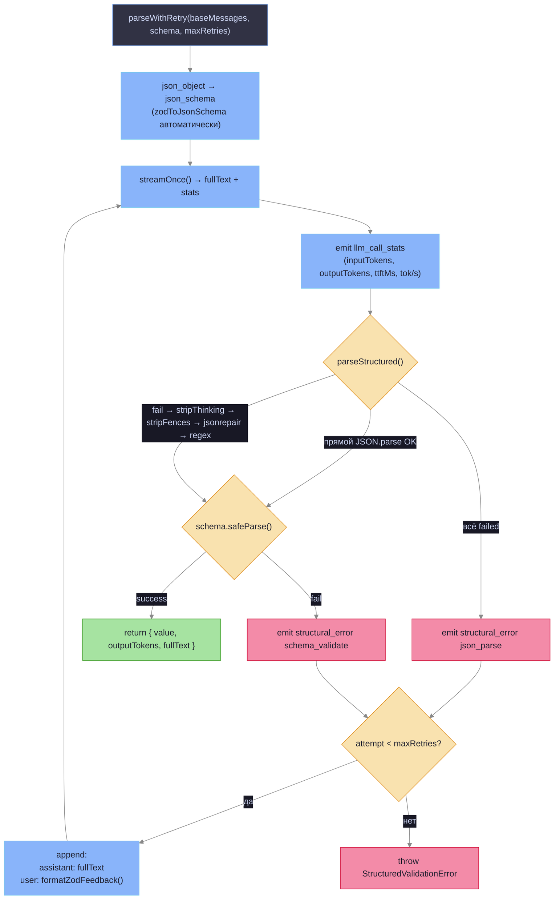
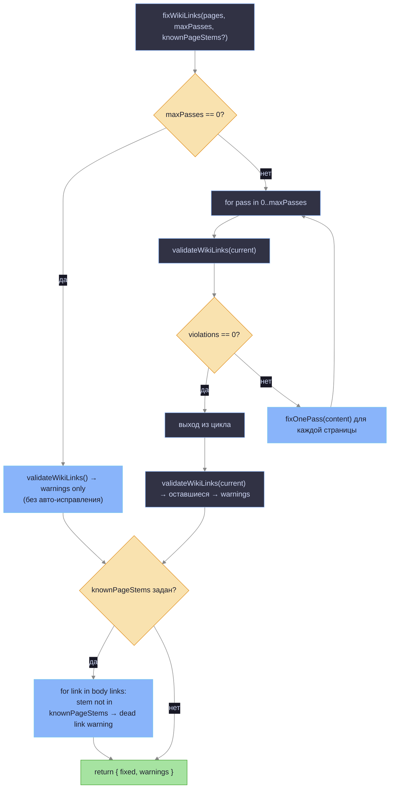
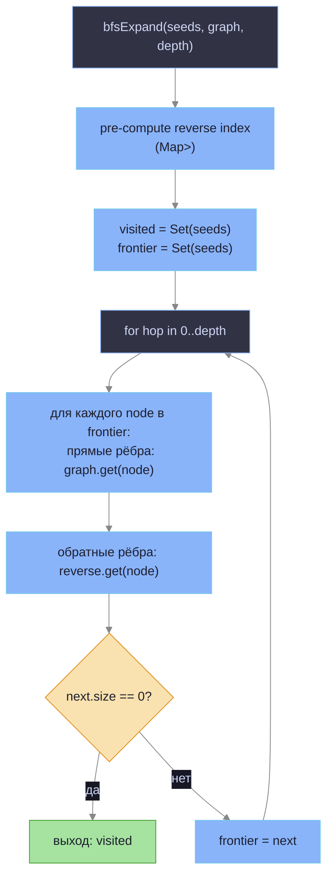
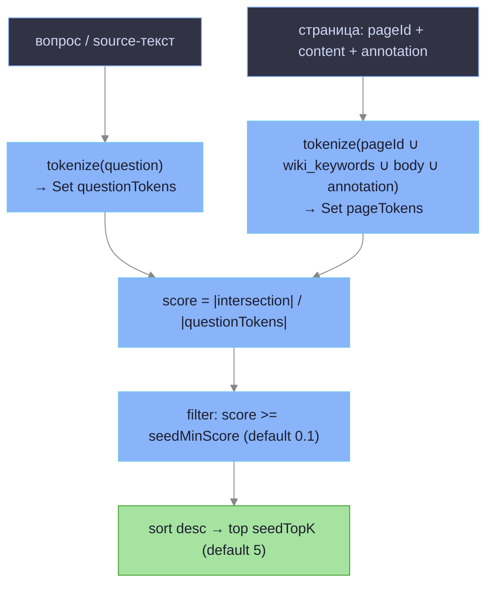
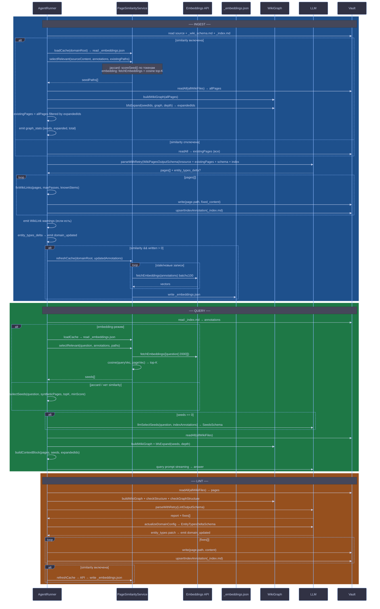

# Prompt Architecture

Архитектура промптов, пайплайнов и функций агента. Описывает как собираются сообщения для LLM, как работают retry-цепочки, граф-поиск и валидация WikiLink.

---

## 1. Операции и зависимости



**Сплошные стрелки** — жёсткая зависимость (операция не запустится без артефакта).  
**Пунктирные стрелки** — мягкая зависимость (chat берёт `context` из результата; без него бесполезен).

| Операция | Требует | Производит |
|---|---|---|
| **init** | — | `DomainEntry`, `entity_types`, `_wiki_schema.md`, `_format_schema.md` |
| **ingest** | `DomainEntry`, `_wiki_schema.md` | wiki-страницы, `_index.md`, `analyzed_sources` |
| **query** | `DomainEntry`, `_index.md`, wiki-страницы | ответ (seeds → BFS → LLM-subset) |
| **lint** | `DomainEntry`, wiki-страницы | lint-отчёт, исправленные страницы, `domain_updated` |
| **lint-chat** | `DomainEntry`, lint-отчёт, wiki-страницы | исправленные wiki-страницы |
| **chat** | результат любой предыдущей операции | диалог |
| **format** | произвольная страница, `_format_schema.md` | отформатированная страница |

---

## 2. Routing: операция → фаза



Все фазы реализованы как `async function*` — генераторы `RunEvent`. `AgentRunner` итерирует поток и маршрутизирует события в UI.

---

## 3. Промпты по фазам



`evaluator.md` рендерится в роль `user`, но `base.md` всё равно инжектируется через `prependBaseContract` как `system` — применяется ко всем вызовам без исключений.

### Переменные шаблонов (render)

`src/phases/template.ts` — простая интерполяция `{{var}}`:

```typescript
export function render(template: string, vars: Record<string, string>): string {
  return template.replace(/\{\{(\w+)\}\}/g, (_, key) => vars[key] ?? `{{${key}}}`);
}
```

| Операция | Промт | Переменные render() | Схема ответа |
|---|---|---|---|
| **ingest** | `ingest.md` | `domain_name`, `entity_types_block`, `lang_notes`, `wiki_path`, `today`, `schema_block` | `WikiPagesOutputSchema` |
| **query** | `query.md` | `domain_name`, `entity_types_block`, `index_block` | free text |
| **lint** | `lint.md` | `domain_name`, `entity_types_block`, `schema_block` | `LintOutputSchema` |
| **chat** | `chat.md` | `operation_header`, `context` | free text |
| **lint-chat** | `lint-chat.md` | `domain_name`, `lint_report`, `pages_block`, `schema_block` | `LintChatSchema` |
| **init** | `init.md` | `domain_id`, `vault_name`, `schema_block`, `index_block` | `DomainEntrySchema` |
| **format** | `format.md` | `format_schema`, `has_vision` | `FormatOutputSchema` |
| **evaluator** | `evaluator.md` | `operation`, `task_input`, `result` | `{score, reasoning}` |

---

## 4. buildChatParams: сборка сообщений

`src/phases/llm-utils.ts · buildChatParams()` — единственная точка сборки параметров запроса к LLM.



| Опция `LlmCallOptions` | Поведение |
|---|---|
| `systemPrompt` | Добавляет `## Уточнение\n{text}` в конец system-сообщения |
| `jsonMode: "json_schema"` | `response_format: { type: "json_schema", ... }`. Приоритет над `json_object` |
| `jsonMode: "json_object"` | `response_format: { type: "json_object" }` |
| `thinkingBudgetTokens > 0` | Включает extended thinking; снимает `response_format`, `temperature`, `top_p` |
| `temperature`, `maxTokens`, `topP` | Прямая передача в API |

---

## 5. wrapWithJsonFallback: деградация response_format

`AgentRunner` оборачивает `LlmClient` в `wrapWithJsonFallback` (`src/phases/llm-utils.ts`). При ошибке 400/422 с ключевыми словами `"response_format"`, `"json_object"`, `"json mode"`, `"unsupported"` — деградирует `response_format` до следующего уровня.

```mermaid
%%{init: {'theme': 'base', 'themeVariables': {'background': '#1e1e2e', 'primaryColor': '#313244', 'primaryTextColor': '#cdd6f4', 'primaryBorderColor': '#89b4fa', 'lineColor': '#888888', 'secondaryColor': '#181825', 'tertiaryColor': '#45475a'}}}%%
flowchart LR
    S["json_schema"] -->|"400/422 json-mode error"| O["json_object"]
    O -->|"400/422 json-mode error"| N["без response_format"]
    N -->|"любая ошибка"| THROW["throw"]

    classDef ok   fill:#a6e3a1,color:#1e1e2e,stroke:#40a02b
    classDef warn fill:#f9e2af,color:#1e1e2e,stroke:#df8e1d
    classDef err  fill:#f38ba8,color:#1e1e2e,stroke:#d20f39
    class S ok
    class O warn
    class N warn
    class THROW err
```



`degradeResponseFormat()` (`llm-utils.ts:140`): `json_schema` → `json_object` → удалить поле.  
Для стриминга: retry выполняется только если ни одного content-чанка не было получено (reasoning-чанки `delta.reasoning` не считаются контентом).

---

## 6. parseWithRetry: структурированный вывод с retry

`src/phases/parse-with-retry.ts · parseWithRetry()` — используется всеми операциями с JSON-схемой.

**Ключевое:** при `jsonMode: "json_object"` автоматически апгрейдится до `json_schema` через `zodToJsonSchema()`. `superRefine`-правила (например, WikiLink-проверки) в JSON Schema не выражаются — они применяются на уровне Zod после парсинга.



**parseStructured fallback-цепочка** (`llm-utils.ts:17`):
1. `JSON.parse(text)` — прямой
2. `stripThinking()` → убирает `<think>...</think>` блоки thinking-моделей
3. `stripFences()` → убирает ` ```json ` обёртки
4. `jsonrepair(stripped)` — исправляет частично корректный JSON
5. regex `.match(/\{[\s\S]*\}/)` + позиционный `slice` при "Unexpected non-whitespace at position N"

**formatZodFeedback**: при `err === null` → "не валидный JSON"; при `ZodError` → список `path: message` по первым 20 issue.

**streamOnce fallback**: при ошибке стриминга — повтор через non-streaming (`chat.completions.create` без `stream: true`).

### CallSite → схема

| callSite | Фаза | Zod-схема |
|---|---|---|
| `ingest.pages` | `ingest.ts` | `WikiPagesOutputSchema` |
| `init.bootstrap` | `init.ts` файл 0 | `DomainEntrySchema` |
| `init.delta` | `init.ts` файлы 1..N | `EntityTypesDeltaSchema` |
| `lint.fix` | `lint.ts` | `LintOutputSchema` |
| `lint.patch` | `lint.ts` (actualizeDomainConfig) | `EntityTypesDeltaSchema` |
| `lint-chat.fix` | `lint-chat.ts` | `LintChatSchema` |
| `query.seeds` | `query.ts` (llmSelectSeeds) | `SeedsSchema` |
| `format.output` | `format.ts` | `FormatOutputSchema` |

---

## 7. Статистика LLM-вызовов

`src/phases/llm-utils.ts · wrapStreamWithStats()` — декоратор над стримом, собирает метрики без изменения поведения.

```typescript
interface LlmStreamStats {
  inputTokens: number;   // из финального чанка (stream_options.include_usage=true)
  outputTokens: number;
  ttftMs: number;        // время до первого чанка
  llmDurationMs: number; // от первого до последнего чанка
}
```

`buildLlmCallStatsEvent(stats)` эмитирует `RunEvent` с типом `llm_call_stats`, добавляя `inTokPerSec` и `outTokPerSec`.

`computeSpeedText(stats[])` — агрегирует несколько вызовов за операцию: суммирует токены, медианный TTFT.

`extractStreamDeltas(chunk)` читает `delta.content` и нестандартные поля reasoning-моделей (`delta.reasoning`, `delta.reasoning_content`).

---

## 8. WikiLink Validation

`src/wiki-link-validator.ts` — полный цикл проверки и автоисправления WikiLink-нарушений.

### Типы нарушений (ViolationKind)

| Kind | Паттерн | Пример |
|---|---|---|
| `alias` | `[[page\|alias]]` | `[[Процесс\|Шаг 1]]` — алиасы запрещены |
| `path` | `[[path/to/page]]` | `[[Folder/Page]]` — пути запрещены, только stem |
| `inline-json` | `wiki_outgoing_links: [...]` | JSON-массив в одну строку (нарушение формата frontmatter) |
| `outgoing-desync` | body links ≠ fm links | тело содержит `[[A]]`, `[[B]]`, но `wiki_outgoing_links` содержит только `[[A]]` |

### fixWikiLinks: алгоритм



**fixOnePass** (`wiki-link-validator.ts:49`):
1. `stripAlias(body)` — `[[page|alias]]` → `[[page]]`
2. `stripPath(body)` — `[[path/to/page]]` → `[[page]]` (берёт последний сегмент)
3. inline-json в frontmatter → разворачивает в блок `- "[[link]]"`
4. `setFmLinks(fm, bodyLinks)` — синхронизирует `wiki_outgoing_links` в frontmatter с body

**Dead link detection**: проверяет только stems (`link.split("/").pop()`), не полные пути. `knownPageStems` строится из существующих wiki-страниц (`Set<string>`).

### Интеграция в ingest

`src/phases/ingest.ts:182` — после получения страниц от LLM, до записи в vault:

```typescript
const wlFixResult = fixWikiLinks(pagesMap, wikiLinkValidationRetries, knownStems);
// wikiLinkValidationRetries: из настроек (default 3)
// knownStems: stems из existingPaths + stems новых страниц этого же ingest-вызова
```

Предупреждения накапливаются и эмитируются единым событием **после** завершения write-цикла:

```typescript
// ingest.ts:275
yield { kind: "info_text", icon: "⚠️", summary: "WikiLink warnings", details: wlFixResult.warnings };
```

| Параметр | Источник | Default |
|---|---|---|
| `maxPasses` | `wikiLinkValidationRetries` из настроек | `3` |
| `knownPageStems` | existing wiki paths + новые страницы текущего ingest | строится в фазе |

---

## 9. Граф вики и BFS-расширение

`src/wiki-graph.ts` — построение графа WikiLink и обход BFS от seed-страниц.

### Структура графа

```typescript
type WikiGraph = Map<string, Set<string>>;
// key: pageId (stem страницы), value: Set<string> исходящих ссылок
```

`buildWikiGraph(pages)` — парсит `[[link]]` из тела каждой страницы через regex `/\[\[([^\]|#]+)/g`.

### BFS-расширение (undirected)



Граф обходится **без направления**: прямые рёбра (A→B) и обратные (B→A backlinks) равнозначны. Depth=1 (default) означает непосредственных соседей seeds в обоих направлениях.

Проверки качества графа (`checkGraphStructure`): изолированные узлы (нет in/out рёбер), hub-узлы (> `hubThreshold` исходящих), несимметричные ссылки.

---

## 10. PageSimilarityService: выбор релевантных страниц

`src/page-similarity.ts` — решает O(N) проблему: вместо передачи всех wiki-страниц в контекст LLM выбирает top-K наиболее релевантных через Jaccard или embedding.

### Два режима

| Режим | Метод | Требования |
|---|---|---|
| `jaccard` | Пересечение токенов source-файла и аннотаций `_index.md` | — |
| `embedding` | Косинусное сходство float32-векторов | `embeddingModel`, `embeddingDimensions`, `baseUrl`; API-ключ опционален |

При недоступности embedding API — автоматический fallback на Jaccard.

### Jaccard: алгоритм (src/wiki-seeds.ts)



**tokenize** (`wiki-seeds.ts:16`): lowercase → split по `[^\p{L}\p{N}]+` → отбрасывает токены ≤2 символов + стоп-слова (EN + RU). Формула: `|intersection| / |questionTokens|` — не классический Jaccard (union в знаменателе), а покрытие запроса.

### Embedding: кэш векторов

Хранится в `!Wiki/<domain>/_config/_embeddings.json`:

```json
{
  "model": "text-embedding-3-small",
  "dimensions": 1536,
  "entries": {
    "<pageId>": { "vector": "<base64 Float32Array>", "hash": "<annotation hash>" }
  }
}
```

Инвалидация по хэшу аннотации: вектор пересчитывается при изменении текста аннотации в `_index.md`. Смена `model` или `dimensions` — пересоздаёт весь кэш. `refreshCache()` обновляет только устаревшие записи, батчи по 100.

**Косинусное сходство** (`page-similarity.ts:43`):
```typescript
function cosine(a: Float32Array, b: Float32Array): number {
  let dot = 0, na = 0, nb = 0;
  for (let i = 0; i < a.length; i++) { dot += a[i]*b[i]; na += a[i]*a[i]; nb += b[i]*b[i]; }
  return dot / (Math.sqrt(na) * Math.sqrt(nb));
}
```

### Полный lifecycle: ingest + query + lint



### Использование similarity по фазам

| Фаза | loadCache | selectRelevant | refreshCache |
|---|---|---|---|
| `ingest` | ✓ перед отбором | ✓ → BFS-expand | ✓ после записи страниц |
| `init` (файлы 1..N) | — | ✓ (ingest-pass) | — |
| `query` | ✓ (embedding mode) | ✓ → seed selection | — |
| `lint` | — | — | ✓ после прохода |
| `format` | — | — | — |

`PageSimilarityService` ephemeral — создаётся заново на каждый `AgentRunner.run()`. `loadCache()` восстанавливает диск-кэш до первого `selectRelevant()`.

### Настройки

| Поле `nativeAgent` | Тип | Назначение |
|---|---|---|
| `embeddingModel` | `string?` | `undefined` = jaccard; `""` = режим включён, ждёт модель; непустая = embedding |
| `embeddingDimensions` | `number?` | Число измерений; обязательно при `embeddingModel` |
| `relevantPagesTopK` | `number?` | Максимум страниц в контексте (default: 15) |
| `seedTopK` | `number` | Число seeds при Jaccard (default: 5) |
| `seedMinScore` | `number` | Минимальный Jaccard-score (default: 0.1) |

---

## 11. Вторичные LLM-вызовы

### query: многоэтапный отбор контекста

```
1. read _index.md → annotations (без чтения wiki-файлов)
2. seed selection:
   embedding → loadCache + cosine top-K
   jaccard   → selectSeeds() по токенам
   seeds==0  → llmSelectSeeds (parseWithRetry, SeedsSchema)
   seeds==0 после LLM → error
3. readAll(allWikiFiles) → buildWikiGraph → bfsExpand(seeds, depth)
4. buildContextBlock(expanded subset) → LLM только BFS-expanded страницы
5. query prompt streaming → answer
```

### lint: actualizeDomainConfig

После основного `parseWithRetry(LintOutputSchema)` — отдельный вызов:
- анализирует реальный контент wiki vs текущий `entity_types`
- возвращает дельту (`EntityTypesDeltaSchema`, callSite `lint.patch`)
- эмитирует `domain_updated` → контроллер сохраняет в domain-map

### ingest: entity_types_delta

Если LLM вернул `entity_types_delta`:
- `mergeEntityTypes(domain.entity_types, delta)` — merge по ключу `type`
- эмитирует `domain_updated { domainId, patch: { entity_types } }`
- `runInitWithSources` перехватывает событие для обновления `currentDomain` перед следующим файлом

### ingest: retry невалидных путей

При нарушении правила 4 сегментов (`!Wiki/<domain>/<subfolder>/<Article>.md`):
- `splitByPathValidity()` делит страницы на valid/invalid
- `retryInvalidPaths()` — отдельный `buildChatParams`-вызов (free text)
- передаёт оригинальные messages + ошибку как user-сообщение
- ожидает JSON-массив только для невалидных путей

---

## 12. RunEvent: поток событий

Все фазы возвращают `AsyncGenerator<RunEvent>`. Типы событий (`src/types.ts`):

| kind | Описание |
|---|---|
| `tool_use` / `tool_result` | I/O операции с vault |
| `assistant_text` | Стриминг текста LLM; `isReasoning=true` для thinking-чанков |
| `info_text` | Прогресс: выбор страниц, WikiLink warnings, BFS stats |
| `llm_call_stats` | Метрики: inputTokens, outputTokens, ttftMs, tok/s |
| `graph_stats` | seeds[], expanded, total, fromCache |
| `structural_error` | JSON-parse или schema-validate fail с retry-статусом |
| `domain_updated` | Изменение entity_types или language_notes |
| `domain_created` | Новый DomainEntry при init |
| `result` | Финальный текст операции + durationMs |
| `eval_result` | score + reasoning от evaluator (devMode) |
| `format_preview` | Предпросмотр форматирования с отчётом |
