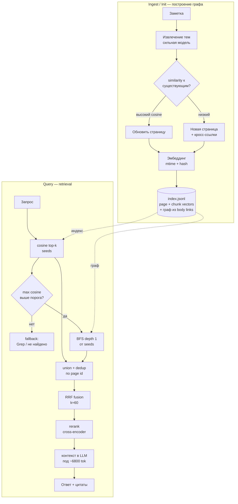

# Повышение качества поиска — obsidian-ai-wiki + векторный слой

Контекст: плагин использует graph BFS (Query) + агентный Grep/Glob (Claude Agent). Поверх добавлен similarity-слой. Граф вики = индекс и для BFS, и для seed-выбора. Рекомендации — состыковать два сигнала и держать граф здоровым.

Текущий storage: каждый домен хранит `metadata.jsonl`, `index.jsonl` и `log.jsonl` прямо в `!Wiki/<domain>/`. `index.jsonl` содержит `page` records для description-seed stage и `chunk` records для clean section vectors; отдельный `_embeddings.json` не используется как runtime source of truth.

---

## Tier 1 — наибольший эффект

### Здоровье графа важнее тюнинга поиска
Фрагментация (одна тема на 3 страницы) бьёт и по BFS, и по seed-выбору.

- **Dedup на Ingest** — similarity к существующим страницам перед созданием новой. Высокий cosine → обновить существующую, не плодить дубль.
- **Lint near-duplicate** — пары страниц выше порога similarity → кандидаты на слияние.
- **Цикл Lint + Fix регулярно** — битые ссылки рвут обход BFS.

### Гибрид retrieval, не dense-only
Документация = имена API, флаги, коды ошибок. Dense их теряет.

- `bge-m3` даёт dense + sparse одной моделью.
- Либо Grep-fallback на точные токены.

### Сильная модель на Ingest/Init
Структура строится один раз, влияет на всё дальше.

- Per-operation models: большая модель на построение (Ingest/Init), дешёвая на Query.

---

## Tier 2 — конвейер Query

### Фьюзия vector + BFS
Не «вектор или граф», а конвейер: вектор находит вход, граф добирает контекст.

```
cosine top-k → seeds → BFS depth 1 → union → RRF (k≈60) → rerank → context
```

- RRF по (vector rank, BFS rank), `k≈60` — без калибровки шкал.
- Альтернатива: `score = α·cosine + β·graph_score`, где graph_score = функция hop-дистанции и числа бэклинков.

### Rerank поверх union
Cross-encoder (`bge-reranker-v2-m3`) → top-5–8 в контекст. Дешёвый прирост precision после фьюзии.

### Порог similarity + fallback
max cosine ниже порога → seeds мусорные. Уходить на keyword/Grep или честное «не найдено», не тащить шум в BFS.

---

## Схема шагов



---

## Tier 3 — гигиена и настройка

- **Инкрементальность векторов** — обновлять `chunk` records в `index.jsonl` на тех же `bodyHash + embedTextHash + model + dimensions`, что и страницу. Удалена страница → удалены её `page`/`chunk` records. Иначе similarity отдаёт устаревшие seeds.
- **Бюджет токенов** — Query ~6800 input/вызов. vector top-k держать 5–8, BFS depth 1, rerank ужимает под бюджет. Без cap контекст переполняется.
- **User prompt на плотные кросс-ссылки** в Ingest — прямо кормит BFS.
- **Temperature 0.1–0.3**, structured output retries вверх на слабых локальных моделях.

---

## Без метрик — тюнинг вслепую

- Собрать 30–50 пар «вопрос → эталонная страница».
- Мерить **Recall@k** и **MRR** отдельно для retrieval, отдельно — качество ответа.
- Сравнивать конфиги (dense-only vs гибрид, с rerank и без, depth 1 vs 2) на одном наборе.
- Для JSONL storage есть HLD harness: `scripts/eval-jsonl-domain-storage.ts`. Он безопасно читает HLD-корпус, строит изолированный eval-домен с `metadata.jsonl` / `index.jsonl` / `log.jsonl`, запускает 5 live retrieval queries against `index.jsonl` и пишет отчёт в `docs/superpowers/evals/`. Legacy `Overlap@5` теперь остаётся no-regression guard, а семантическое качество считается по curated gold set `docs/superpowers/evals/hld-gold-set.json`: `Recall@5`, `nDCG@5`, `MRR`.
- HLD harness сравнивает `weighted-lexical`, `bm25-page`, `bm25-chunk`, `rrf-weighted-bm25`, `rrf-weighted-bm25-legacy`. Текущий HLD прогон: 61 pages, 442 chunks, average improved `Overlap@5 = 0.68` при целевом `0.65`. Gold verdict `needs_tuning`: лучший вариант пока `weighted-lexical` (`Recall@5 = 0.76`, `nDCG@5 = 0.91`, `MRR = 1.00`), BM25/RRF не улучшили aggregate gold metrics без legacy regression. Главный выявленный конфликт: legacy-overlap floors местами удерживают template/readme страницы, которые conservative gold set уже не считает релевантными.

---

## Быстрый референс параметров

| Параметр | Старт | Когда менять |
|---|---|---|
| vector top-k (seeds) | 5–8 | recall низкий → выше, шум → ниже |
| BFS depth | 1 | связанный контекст недобирается → 2 |
| RRF k | 60 | редко трогать |
| rerank → context | top-5–8 | под бюджет токенов |
| similarity порог | подобрать по eval | seeds мусорные → поднять |
| temperature | 0.2 | — |

---

## Если делать одно

**Dedup на Ingest + Lint near-duplicate.** Чистый граф вытягивает и BFS, и seed-выбор разом, без переписывания retrieval. Метрики — чтобы видеть, что именно сработало.
